# Hebrew Alphabet (Alef-Tav)

This is a preliminary research project investigating how the 22 letters of the Hebrew alphabet were part of a calendar system. The innermost planet Mercury has a faster orbit than Earth and creates a pattern of rising and setting at sunset 3 times a year and 22 times over 7 years. Apparent shapes in the Milky Way matching the meaning of each letter appear to have been used to name regions of space along the ecliptic. The sunset horizon was a transverse line to map named regions of the Milky Way to the ecliptic path of the sun, moon, and planets. The following 22 apparent retrograde loops were created using Stellarium, and the letters and meanings were overlaid using GNU Image Manipulation Program. 

Observing Mercury's apparent retrograde motion from earth would manifest as Mercury setting into the sunset, then rising in throughout this page. This transition from an “evening star” to a “morning star” takes about 21 to 24 days.  Stellarium's `View Options=>SSO=>Show Trails` - allows us to trace the trails which in turn is used throughout this page.

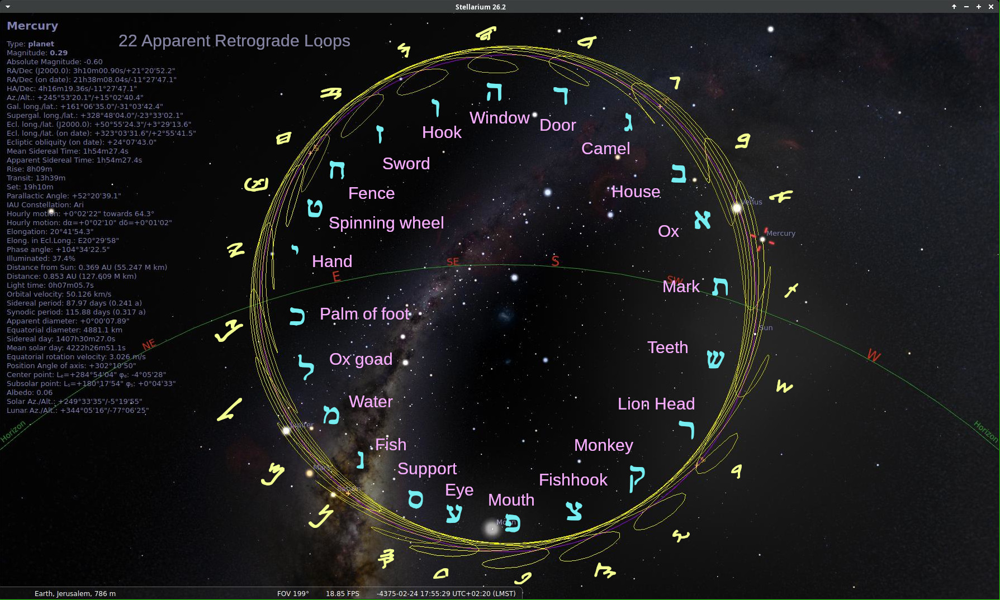
Mercury's 22 apparent retrograde loops starting in *Alef/Ox* date: -4382, 2, 26.

| REGION 1 | REGION 2 | REGION 3 |
|----------|----------|----------|
| Alef     | Khet     | Samekh   |
| Tav      | Zayin    | Nun      |
| Shin     | Vav      | Mem      |
| Resh     | He       | Lamed    |
| Qof      | Dalet    | Kaph     |
| Tsadi    | Gimel    | Yod      |
| Pe       | Bet      | Tet      |
| Ayin     | *Alef*   | -        |

---
## Overview

For each letter:
 - Stellarium image of the location of Mercury's retrograde loop position.
 - Image of [11Q1 - 11Q paleoLev](https://www.deadseascrolls.org.il/explore-the-archive/image/B-513117) Paleo-Hebrew letter overlaid over that region.
 - Follow the green sunset horizon line to the Milky Way...
 - Use the meaning of the Paleo-Hebrew Letter to identify both the shape and the letter itself.
 - Discussion on each.
   - Easy to find or Difficult to find matches.
   - Multiple matches or no matches.

The night sky acts as a universal canvas for human pareidolia, where the shapes projected onto the stars reveal far more about an observer's cultural era. When researching historical astronomy, it is essential to recognize that celestial patterns are not objective forms but subjective cultural artifacts. A single grouping of stars might represent a mythological hero to one civilization and a commonplace agricultural tool to another, and even a single celestial region can have multiple layered likeness comparisons that overlap across time and traditions. This diversity of human perspective is why planetarium software like Stellarium has many sky cultures available to view, reminding us that any historical description must be read as a fluid, era-dependent translation of the sky rather than a fixed astronomical truth.

---

## 1. Aleph (אָלֶף) — א

**Meaning:** Ox

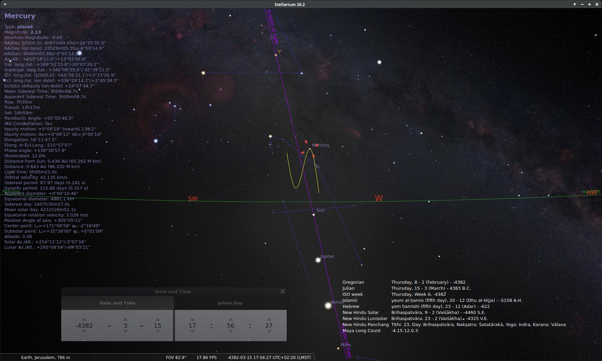

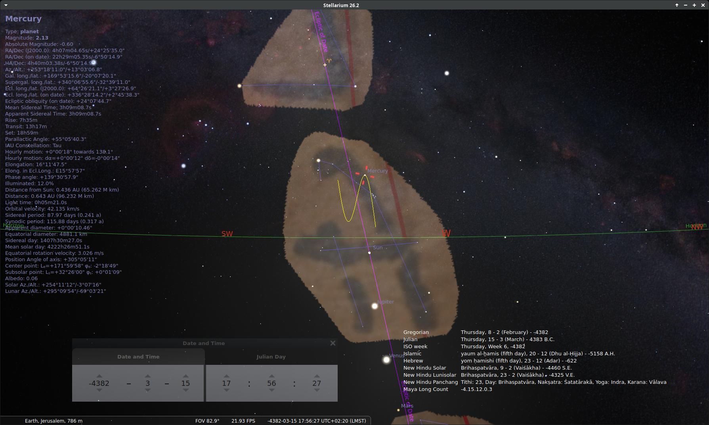

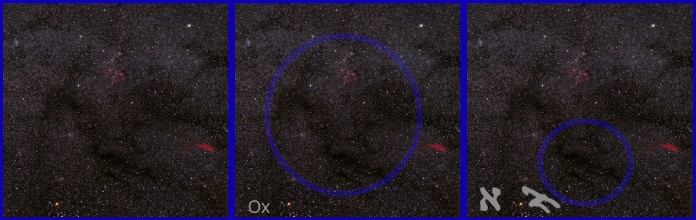

**Discussion:**
 - Lexical meaning: Ox (certain).
 - Ox shape: found one (easy).
 - Paleo-Hebrew letter shape: found one (easy).
 - Ktav Ashuri (Assyrian script) letter shape: found one (easy).
 - Sound: A

Instead of following the horizon to the Milky Way on the right, this letter is touching the Milky Way above.

The star region shows an apparent shape of an Ox which was easy to find.  In Stellarium's Sky Cultures, we find this region has a shared meaning with various other cultures through time:
 - Bull
 - [Taurus](https://en.wikipedia.org/wiki/Taurus_(constellation)) (Roman/Latin for Bull)

The Alef letter shape is not depicting the Ox itself but rather a dark cloud nebula at the mouth of the Ox.  This makes sense because the sound of Alef resembles the sound that an Ox makes. See [Decoding Alef: An Ox shape in the nebula? #19](https://www.youtube.com/watch?v=p5pBJx-jWuE).

It seems the clear dark desert skies of the fertile crescent gave astronomers and astrologers the apparent shape of an Ox or Bull in the Milky Way that was passed between nations. Hebrews, Egyptians, Babylonians, Medes and Persians, Greeks, Romans, etc.  However, it is apparent that not all astronomers could observe the Milky Way from the clear desert sky regions, not to mention those at latitudes and time periods where the horizon did not align with the ecliptic path.  The latter astronomers had to rely on the stars only — even to the point where the Milky Way shapes seem to have been forgotten.  Forgotten until around 2021, in the second year of this preliminary research, where I started noticing these shapes and correlations.

---

## 2. Bet (בֵּית) — ב

**Meaning:** House

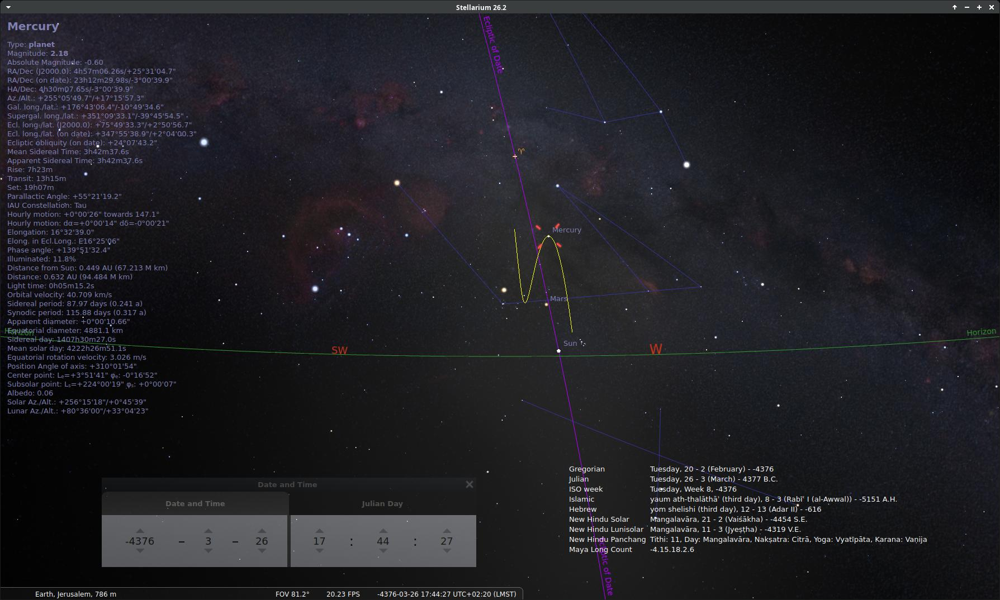

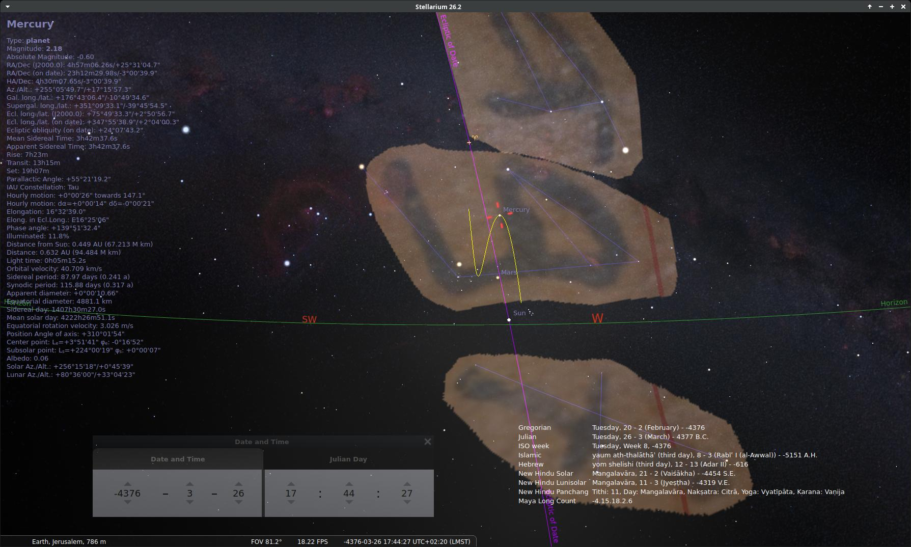

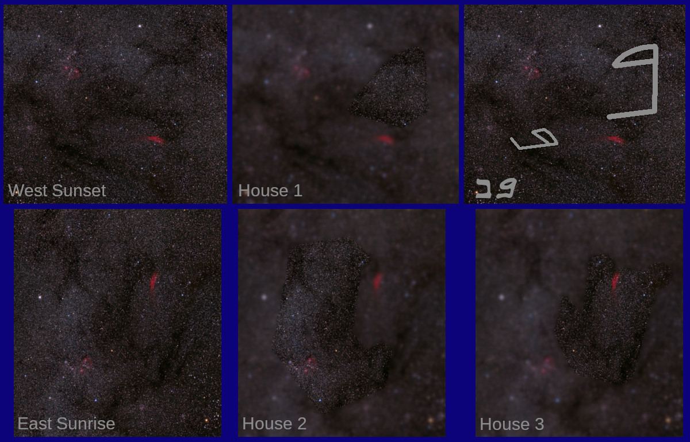

**Discussion:**
 - Lexical meaning: House (certain).
 - House shape: found multiple.
 - Paleo-Hebrew letter shape: found multiple.
 - Ktav Ashuri (Assyrian script) letter shape: similar to Paleo-Hebrew.
 - Sound B

The regions where the ecliptic path bisects the Milky Way are more difficult to interpret, as there are multiple shapes that match the meaning of the letter.  Top row of the above image represents looking West as the Milky Way goes toward sunset where a simple house is seen wide at the bottom narrow at the top. The bottom row is the Milky Way as it rises in the east, which has two temple-like houses. The last resembles the temple that David and Solomon worked on, which had a tall front face and two pillars.

[Decoding Beth: a House shape in the nebula? #21](https://www.youtube.com/watch?v=kCLfgkLFryU)

---

## 3. Gimel (גִּימֶל) — ג

**Meaning:** Camel

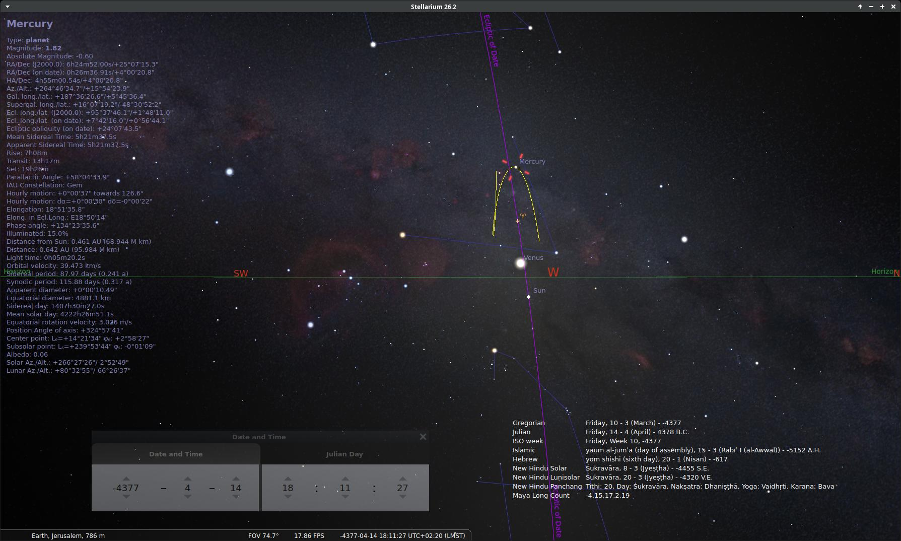

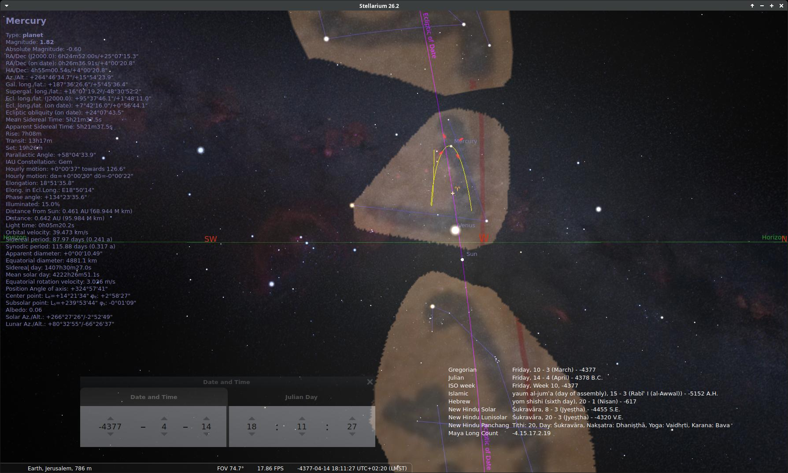

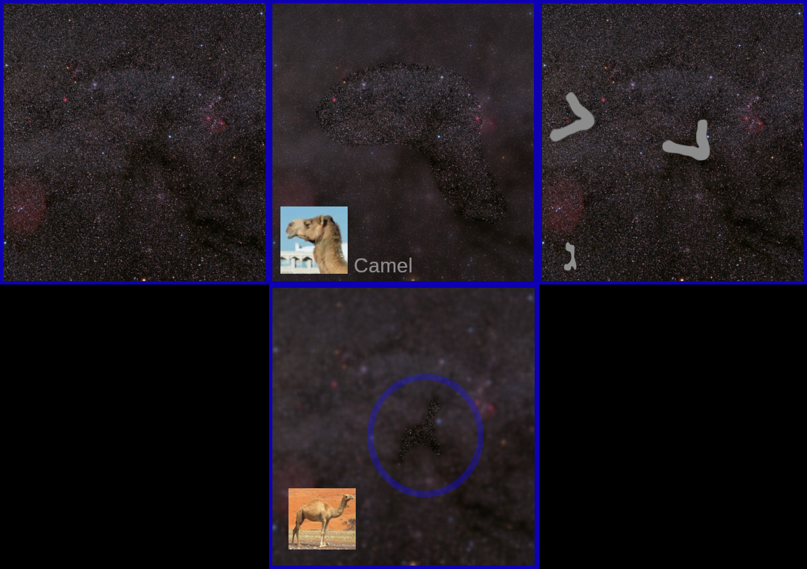

**Discussion:**
 - Lexical meaning: Camel (certain).
 - Camel shape: found two.
 - Paleo-Hebrew letter shape: found multiple.
 - Ktav Ashuri (Assyrian script) letter shape: found multiple.
 - Sound: G

There seem to be 2 Camel shapes that match.  There are also about 2 regions that match the letter shape.

See [Decoding Gimel: A Camel shape in the nebula? #20](https://www.youtube.com/watch?v=n0SOUpVgzXM)

---

## 4. Dalet (דָּלֶת) — ד

**Meaning:** Door

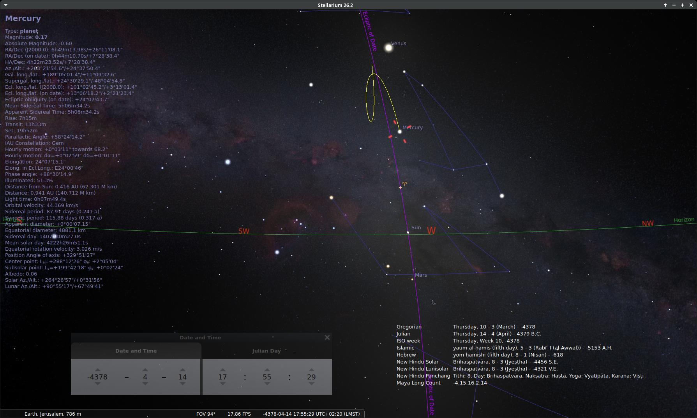

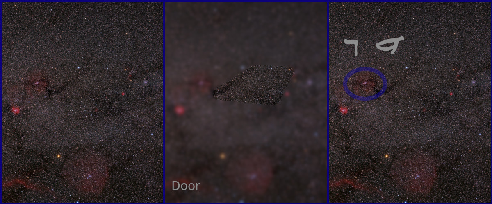

**Discussion:**
 - Lexical meaning: Door (certain).
 - Door shape: found difficult.
 - Paleo-Hebrew letter shape: found.
 - Ktav Ashuri (Assyrian script) letter shape: found. 
 - Sound: D

The door shape itself is very faint. The apparent shape of the letter has a dark tail off to the right that does not match the letter exactly.
 
---

## 5. He (הֶה) — ה

**Meaning:** Window or lattice

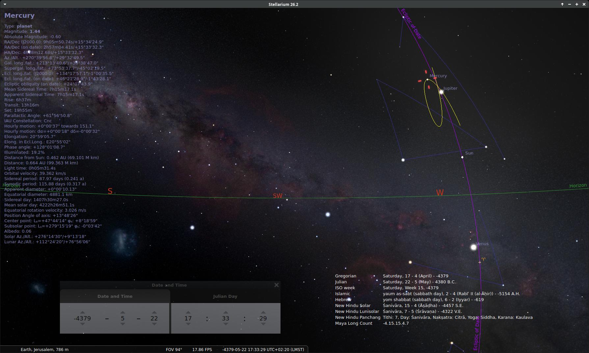

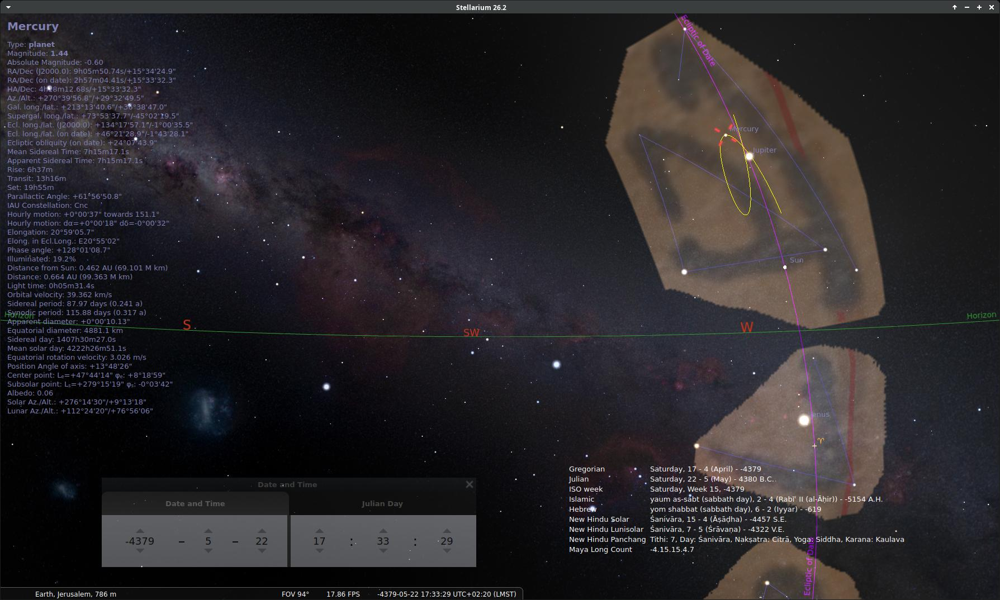

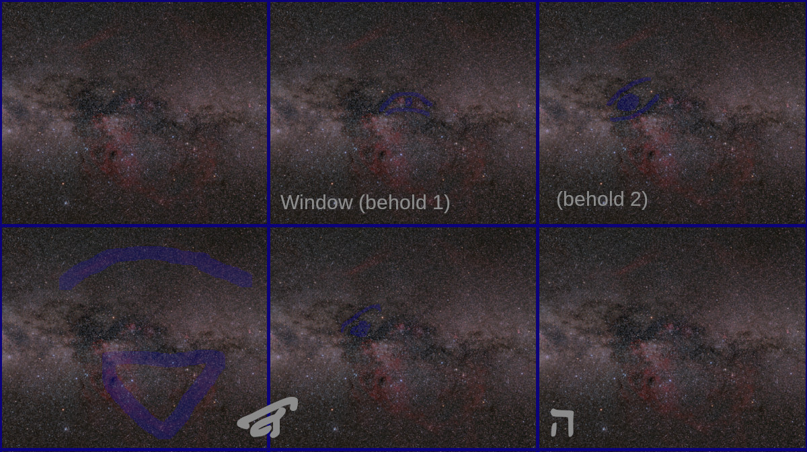

**Discussion:**
 - Lexical meaning: Window/vent/behold (certain).
 - Window shape: there are several window shapes but I think they eye (behold) shape might be inferred - although there is *Ayin/Eye* later in the Alphabet.
 - Paleo-Hebrew letter shape: found two.
 - Ktav Ashuri (Assyrian script) letter shape: not found
 - Sound: H

*Hey* means **window** as well as how you interact with a window: **behold**. (Gen. 47:23)

The larger Paleo-Hebrew *Hey* shape (bottom left) is in the red light spectrum and I am unsure if the human eye can detect the red Paleo-Hebrew letter *Hey* shape. I live too far north and not in dry desert to observe.  The bottom center *Hey* matches both the letter *Hey* and the *behold*.

This portion of the Milky Way also sits low on the horizon, so it would have been more difficult to see as the light passes through more of earth's atmosphere.

---

## 6. Vav (וָו) — ו

**Meaning:** Hook (conjunction joining two ideas)

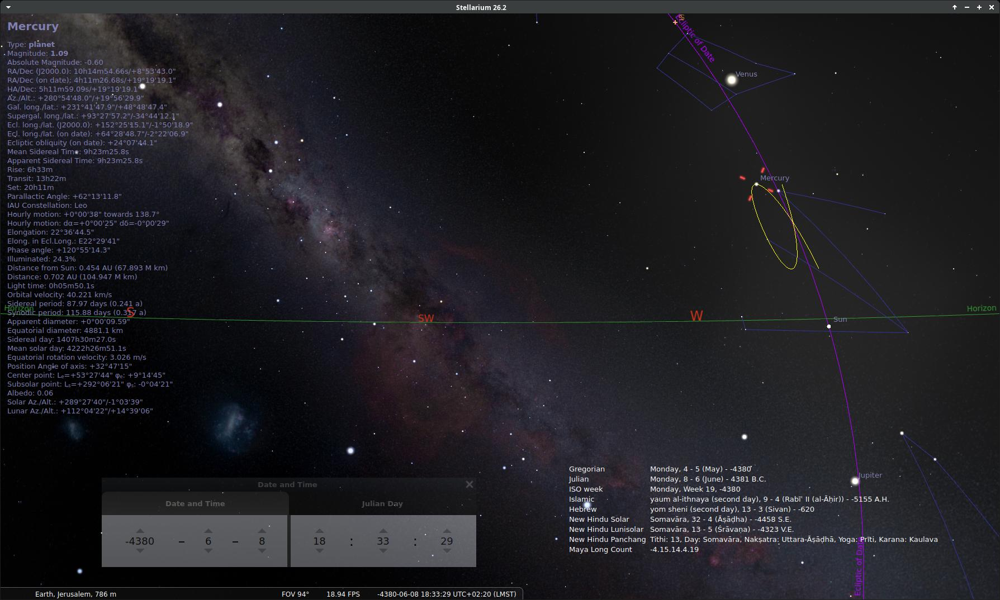

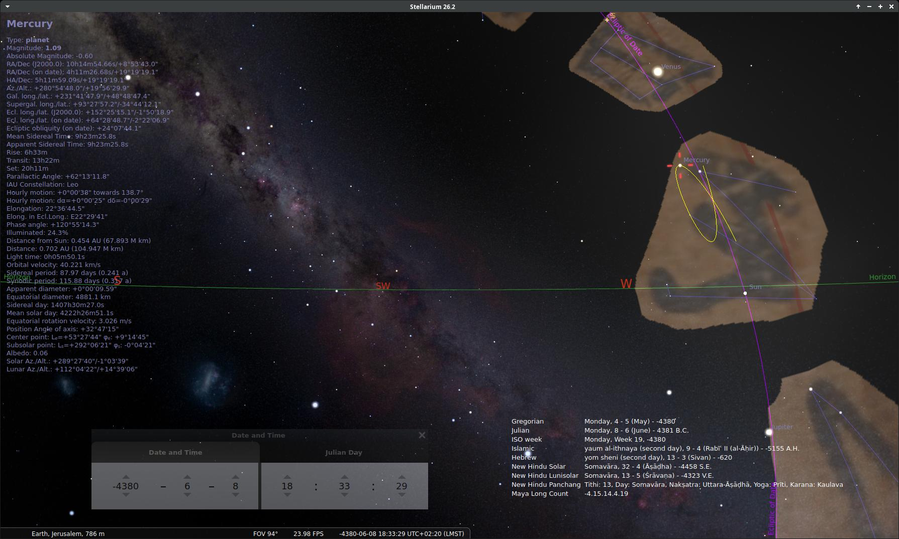

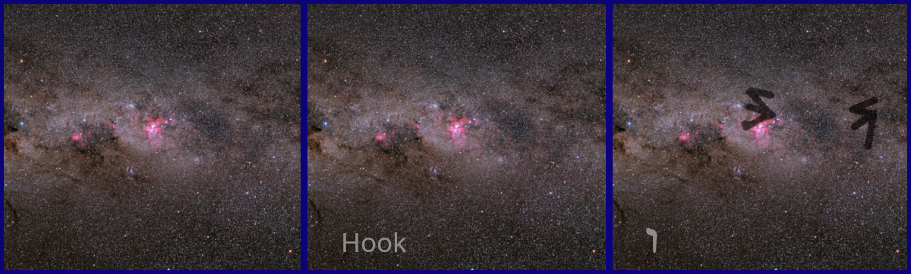

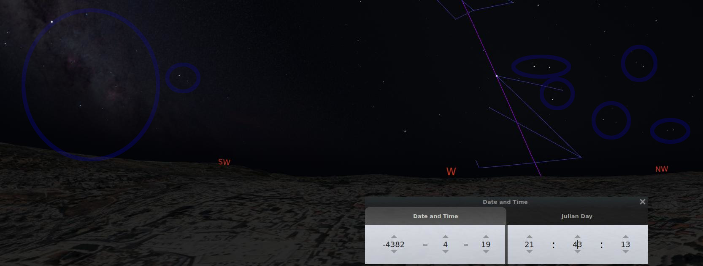

**Discussion:**
 - Lexical meaning: Hook (certain).
 - Hook shape: not found.
 - Paleo-Hebrew letter shape: found (difficult).
 - Ktav Ashuri (Assyrian script) letter shape: not found. 
 - Sound: O

*Vav* or *Waw* is in a portion of the Milky Way that is very close to the southern horizon, making this region more difficult to observe from the fertile crescent.

*Hook* is a bit too vague of a term to find a shape.  It was also difficult to find both the Paleo-Hebrew and Ktav Ashuri shapes.

*Waw* has the sense of hook, join, and the letter is fittingly used as a conjunction to join thoughts in writing and is translated as: *AND*.  The ecliptic region of *Waw* has multiple side-by-side pairs of stars in the last image above.

---

## 7. Zayin (זַיִן) — ז

**Meaning:** Weapon

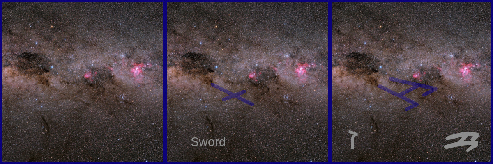

**Discussion:**
 - Lexical meaning: Weapon (uncertain).
 - Weapon shape: found.
 - Paleo-Hebrew letter shape: found.
 - Ktav Ashuri (Assyrian script) letter shape: found. 
 - Sound: Z

Since the lexical meaning is uncertain, the notes below may or may not help in understanding the nebula shapes being described. Possible meanings of the Hebrew letter Zayin (ז):

### Traditional Meaning
* The traditional Gesenius meaning for Zayin is "sword" or "weapon".
* Although the modern letter resembles a sword, the Biblical Hebrew word for sword (*Kherrev* / חֶרֶב) does not contain the letter Zayin.

### Additional Lexicon Definitions
* **Aramaic Lexicon:** Words starting with Zayin include "brightness" or "splendor" (זִיו), "feed" or "well fed" (זוּן), and "food" or "sustenance" (מָזוֹן). In מָזוֹן the mem-prefix makes the three-letter root ז-ו-ן ("to feed, to be well fed") passive: "that which is fed" — food, sustenance.
* **Reproduction / Harlotry:** The root (זָנָה) refers to committing fornication or acting as a harlot (both physical and spiritual).

### Primary Acrostic Meaning (see Note 1)
* **Remember (זכר):** This is the most frequently used headword to represent Zayin in the acrostic scriptures (e.g., Psalms 25:6, 119). 
* The BDB lexicon lists this same letter sequence (זכר) as a verb meaning "to remember" and as a masculine noun meaning "male".

### Other Words Used in Acrostic Scriptures (see Note 1)
* **This (זֹאת / זֶה):** Used multiple times in Psalms and Lamentations.
* **Songs / Sing (זְמִרוֹת / זַמְּרוּ):** Connected to the release of dopamine and oxytocin, which cause lyrics to be remembered.
* **Plots / Considered (זֹמֵם / זָמְמָה):** Found in Psalms and Proverbs.
* **Arises (זָרַח):** Found in Psalm 112:4.
* **The-proud (זֵדִים):** Found in Psalm 119:51.
* **Horror (זַלְעָפָה):** Found in Psalm 119:53.
* **Hath-cast-off / Reject (זָנַח):** Used in Lamentations 2:7, correlating with historical rejections and temple destructions.
* **Purer (זַכּוּ):** Found in Lamentations 4:7.

Note 1: I have not (yet) found a definitive pattern in the Acrostic Alphabetical Psalms that describe the alphabet itself.

Note 2: This page is about the 22-Mercury-Retrograde calendar. When we get to the 12-month-lunar calendar, this relates to: "Let Asher be blessed with children: let him be acceptable to his brethren, and let him **dip his feet in butter**" (Deut 33:24, KJV).

---

## 8. Khet (חֵית) — ח

**Meaning:** Fence

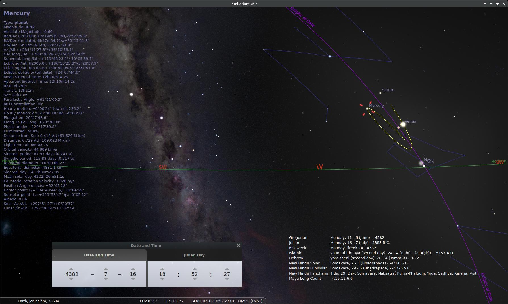

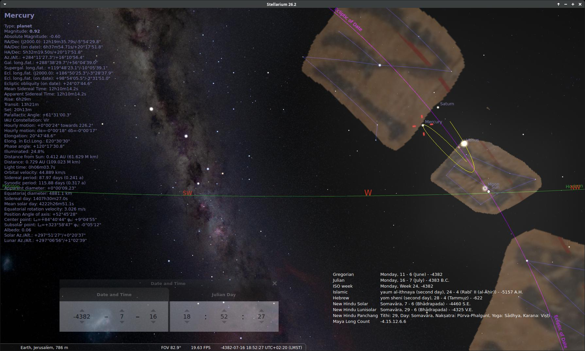

**Discussion:**
 - Lexical meaning: Fence (uncertain).
 - Fence shape: found.
 - Paleo-Hebrew letter shape: found.
 - Ktav Ashuri (Assyrian script) letter shape: pending. 
 - Sound: kh - guttural back of throat.

### Khet (חֵית) — Etymology & Morphology Notes

*Khet* (ח), also spelled *Chet* or *Heth*, is a guttural letter pronounced from the back of the throat, similar to the "ch" in *Bach*.

### Letter Name
- Spelled Ḥet-Yod-Tav (ח-י-ת). Not a productive Hebrew root on its own.
- [Jewish Encyclopedia (1906)](https://www.jewishencyclopedia.com/articles/7653-het): name "perhaps means 'hedge,' 'fence'"; notes that the name in its current form is Aramaic.
- Gesenius: "fence."
- The standard Biblical Hebrew words for "fence" or "wall" are *gadar* (גָּדַר) and *batsar* (בָּצַר), while the word *khet* itself is not found in standard lexicons as a fence. It could be that the scholars were only accounting for the shape of the letter, without investigating its spelling and meaning — unlike the letters whose meanings are more obvious (Alef = Ox, Beth = House, Gimel = Camel, Ayin = Eye, etc.).

### Two Competing Derivations (Wikipedia, "Heth")
1. **Courtyard/enclosure**: shape traced to Egyptian hieroglyph for "courtyard" (ḥwt) — cognate to Hebrew חָצֵר (chatzer), "courtyard."
2. **Thread/wick**: shape traced to hieroglyph for a twisted flax wick — cognate to Hebrew חוּט (chut), "thread."
   [Wikipedia, "Heth"](https://en.wikipedia.org/wiki/Heth)

### Balashon
- Source: [Balashon, "chet"](https://www.balashon.com/2006/08/chet.html)
- Name derives from חַיִץ (chayitz), "fence, partition."
- Arabic/Syriac heth is cognate to chayitz — Arabic ḥāʾiṭ (حائط), "wall."
- chayitz derives from חוּץ (chutz), "outside" (→ חִיצוֹן chitzon, "external").
- Connects to root חצה, "to divide" → חֲצִי (chetzi, "half"), חֲצוֹת (chatzot, "midnight").
- Related divide/partition root חצץ → מְחִיצָה (mechitza, "partition").
- Root cluster: ח-צ-ה / ח-י-ץ ("divide/enclose/exclude") — attested throughout Biblical Hebrew (chetzi, chatzot, chatzer, mechitza). This is a real lexical anchor, not just shape-reading.

### Bottom Line
- "Fence" is a shape-reading of the letter glyph — but it can be anchored by reading the final letter as a *tsade* instead of a *tav*: the חצה / חיץ root cluster.

---

## 9. Tet (טֵית) — ט

**Meaning:** Serpent, clay, or a spinning wheel

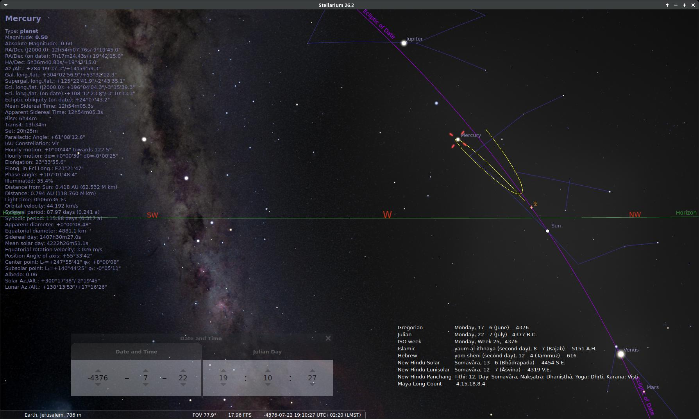

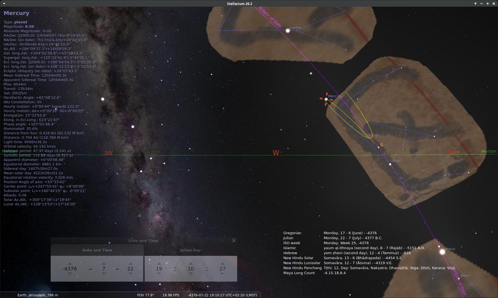

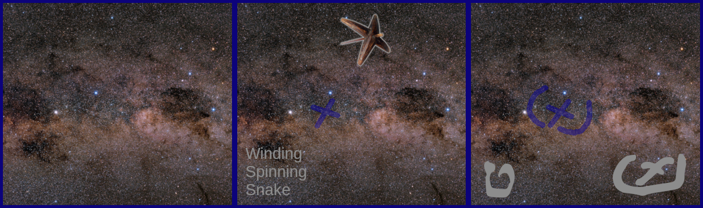

**Discussion:**
 - Lexical meaning: Spinning wheel, serpent, clay (uncertain).
 - Spinning wheel, serpent, or clay shape: found.
 - Paleo-Hebrew letter shape: found.
 - Ktav Ashuri (Assyrian script) letter shape: not easily found. 
 - Sound: T

The letter Tet today makes a 't' sound.  Yet it is difficult to understand how a snake or a spinning wheel relates to the sound 't'.  Two suggestions for the sound and shape come from spinning wool and the saw-scaled viper.

Instrument for whorl- or drop-spinning wool into thread.
[Sisian History Museum in Armenia](https://www.sisianmuseum.am/gallery.php?lng=1&parent_id=4)

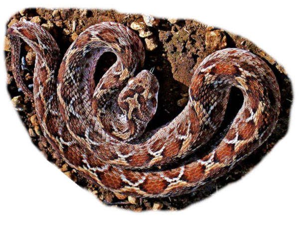
Saw-scaled viper (*Echis carinatus*) curls into the same Tet shape and has the same `t` or `+` shape on top of its head.
 - [Reptile Database](https://reptile-database.reptarium.cz/Echis/carinatus).

Since these letter symbols represent sounds, this viper's sound is significant.  The viper's sound is similar to the sound of working with wool before carding and spinning.
 - [Saw-scaled viper sound](https://www.youtube.com/watch?v=BNAO-KCxBpE)
 - [Pulling Wool](https://youtu.be/GSJzuQFrFjw?si=zM4YsWGTzI22pMg2&t=254)

The sound this poisonous viper made would have been well known in the fertile crescent region.  The clay connection is also in the name: the Hebrew word *tit* (טיט) means "mud, mire, or wet clay" — a near-homophone of the letter name.  The saw-scaled viper lives in the wadis where this wet clay is found, and when it dries it buries itself in it with only its eyes above the surface.

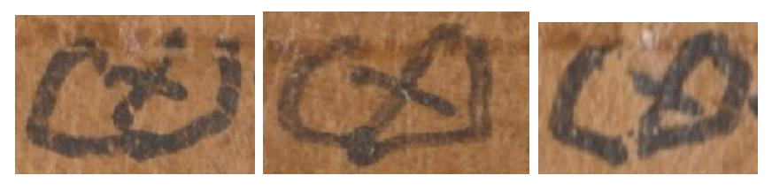

If this letter indicated the same sound as the viper and the spinning/pulling of wool, this would suggest that the modern Tet sound has changed with the passage of time and culture.  Today, the sounds are converging into what is called Modern Hebrew.  However, in the past there have been distinctions among Ashkenazi, Sephardic, Yemenite, and Mizrahi Hebrew.  Even after the Babylonian captivity, we learn of shifts in the language of the people of the book:

> "So they read in the book in the law of God distinctly, and gave the sense, and caused them to understand the reading." (Nehemiah 8:8)

During the 70-year captivity in Babylon, many Israelites had adopted Aramaic as their daily spoken language and lost their fluency in ancient biblical Hebrew. Because of this shift, when Ezra read the original Hebrew text aloud, the Levites stationed among the crowd had to actively translate it into Aramaic and explain its meaning ("give the sense") so the common people could understand the laws.  

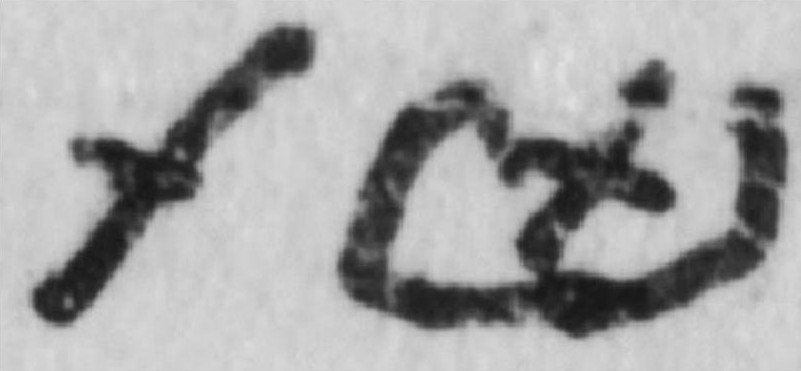
The Paleo-Hebrew Tet (right) has some resemblance to Tav (left).

---

## 10. Yod (יָד) — י

**Meaning:** Hand

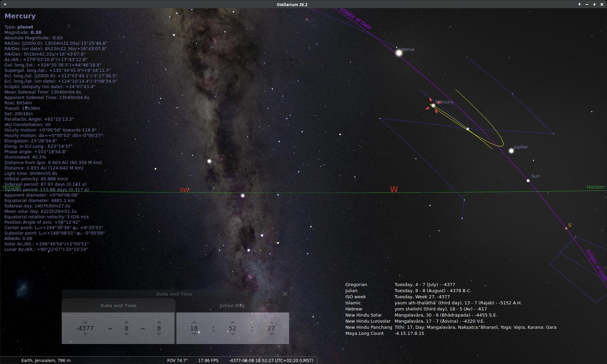

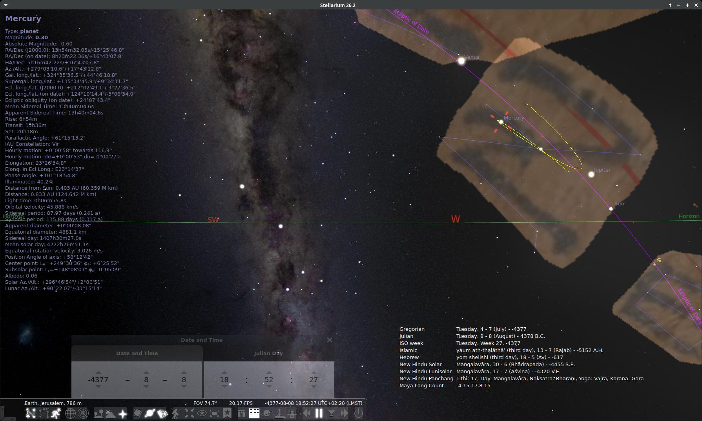

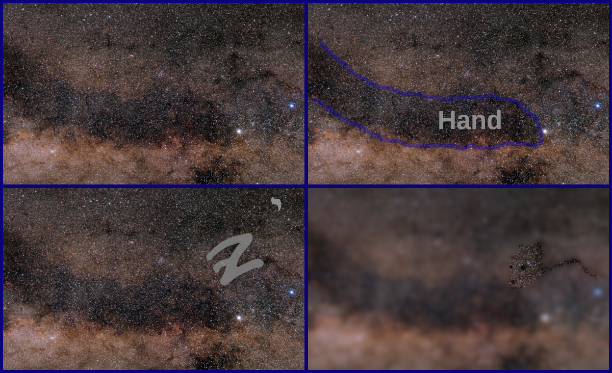

**Discussion:**
 - Lexical meaning: Hand (certain).
 - Hand shape: found.
 - Paleo-Hebrew letter shape: found.
 - Ktav Ashuri (Assyrian script) letter shape: found.
 - Sound: Y

See [chapter 43](https://www.youtube.com/watch?v=D2RI6_u6ArA&list=PLbRaSh0207d5oxxRnekgN2GdKQNFtZT2z&index=44).

This is one of the easier regions to recognize as a *hand*. Also, at the tip of the hand is an easily visible Paleo-Hebrew letter Yod. The traditional meaning of the letter *Yod*—*hand*—matches a Yod, Kaph, Kaph, Yod pattern found in the acrostic of Proverbs 31.

> *Her-hands* (יָדֶיהָ) she hath sent forth on a spindle,  
> And-her-hands (וְכַפֶּיהָ) have held a distaff.  
> Her-hand (כַּפָּהּ) she hath spread forth to the poor,  
> *And-her-hands* (יָדֶיהָ) she sent forth to the needy.  
> Proverbs 31:19–20  

A related word to “hand” is “praise,” as lifting up the hands is a gesture of praise. The words *Jew* and *Judah* (*Yehudah*) are related to this word.

> And she conceived again and bore a son, and said,  
> “Now I will praise the LORD (אוֹדֶה אֶת־יְהוָה).”  
> Therefore she called his name Judah (יְהוּדָה). Then she stopped bearing.  
> Gen 29:35  

> Judah (יְהוּדָה), your brothers shall praise (יָדָה) you;  
> Your hand (יָד) shall be on the neck of your enemies;  
> Your father’s sons shall bow down to you.  
> Judah (יְהוּדָה) is a lion’s whelp;  
> From the prey, my son, you have gone up.  
> He couches, he lies down as a lion,  
> And as a lion, who dares rouse him up? (This is describing the lion’s roar.)  
> The scepter shall not depart from Judah,  
> Nor the ruler’s staff from between his feet,  
> Until Shiloh comes,  
> And to him shall be the obedience (יִקָּהָה) of the peoples.  
> He ties his foal to the vine,  
> And his donkey’s colt to the choice vine;  
> He washes his garments in wine (יַיִן),  
> And his robes in the blood of grapes.  
> His eyes are dull from wine (יַיִן),  
> And his teeth white from milk.  
> Gen 49:8–12  

Note: The blessing on Judah describes this region, including the lion’s whelp outlined in the image above: 'He couches, he lies down as a lion'.  This became a good starting point for decrypting the 12-month lunar calendar where each tribe, as ordered in the Book of Numbers, describes a region of the Milky Way similar to this 22-letter apparent retrograde loops of Mercury calendar system.  TODO: add link to 12-month tribe calendar.

> And this regarding Judah (לִיהוּדָה); so he said,  
> “Hear, O LORD, the voice of Judah (יְהוּדָה),  
> And bring him to his people.  
> With his-hands (יָדָיו) he contended for them,  
> And may You be a help against his adversaries.”  
> Deut 33:7  

> Praise-Thee (יוֹדוּךָ), O Yahweh (יְהוָה), do all Thy works,  
> And Thy saints do-bless-Thee (יְבָרֲכוּכָה).  
> Psalm 145:10  

> “Hear the voice of my supplications,  
> when I cry unto thee,  
> when I lift up my hands (יָדַי) toward thy holy sanctuary.”  
> Psalm 28:2  

> “Lift up your hands (שְׂאוּ־יְדֵכֶם) in the sanctuary,  
> and bless the LORD.”  
> Psalm 134:2  

> “And Aaron lifted up his hand (יָדָיו) toward the people, and blessed them…”  
> Lev 9:22  

The main character of the Tanakh (OT) is Yahweh. Yod at the beginning of a word means "He-will" (3rd person).

In this time period, the summer/fall harvest would take place: grapes, figs, pomegranates, and olives.

---

## 11. Kaph (כָּף) — כ

**Meaning:** Palm (of the hand or foot)

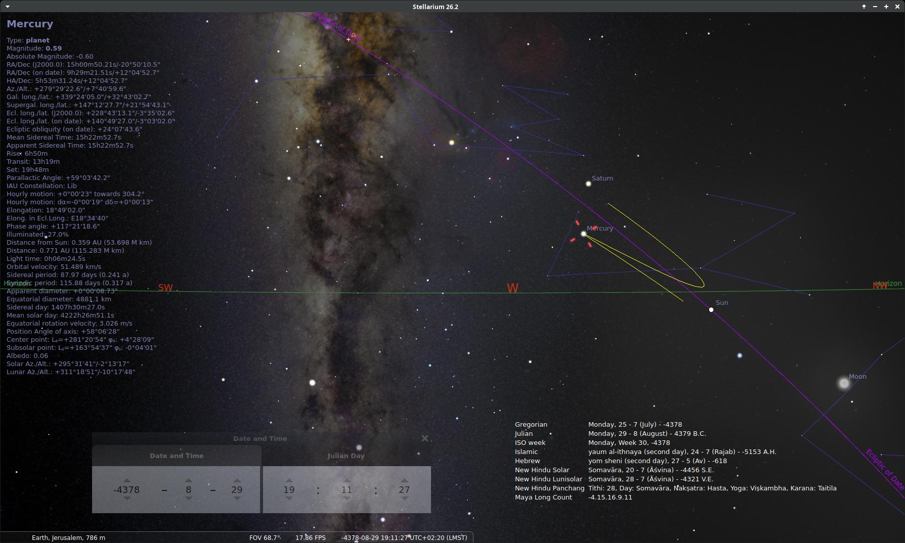

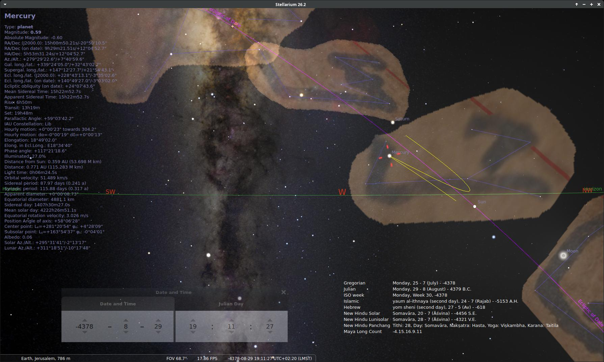

**Discussion:**
 - Lexical meaning: Palm of hand *or foot*.
 - Palm shape: found.
 - Paleo-Hebrew letter shape: found.
 - Ktav Ashuri (Assyrian script) letter shape: found. 
 - Sound: K
 - BDB Lexicon defines (כַּף) as: hollow, or flat of the hand, palm, sole of foot, pan.

 It seems this may be describing the same large dark "hand" region - but this time focusing on the hollow mid section of the palm of the hand, or arched section of a foot.

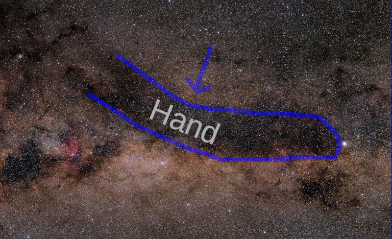

At this time of year, the milky way in relation to the sunset horizon is now upright.  It is in this upright area that we can observe the Paleo-Hebrew letter Kaph around a small foot.

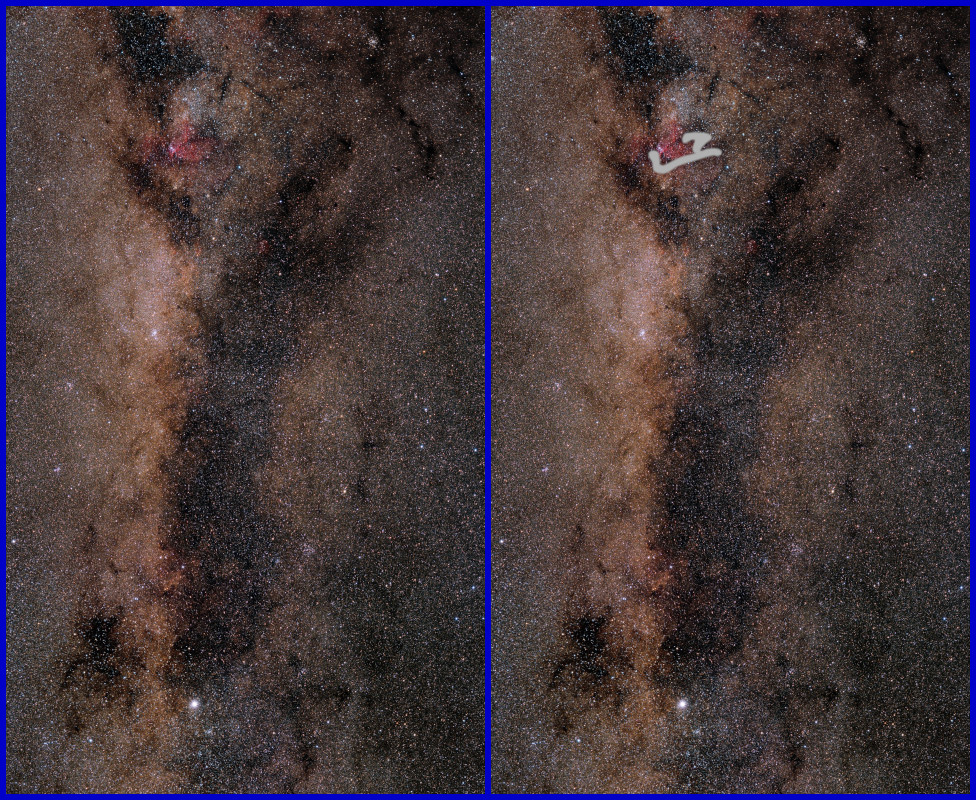

The Ktav Ashuri Kaph is seen in the same region rotate -90deg.

Once again the synonomous meaning can be seen in Proverbs 31 Yod, Kaph, Kaph, Yod pattern.

> *Her-hands* (יָדֶיהָ) she hath sent forth on a spindle,  
> And-her-hands (וְכַפֶּיהָ) have held a distaff.  
> Her-hand (כַּפָּהּ) she hath spread forth to the poor,  
> *And-her-hands* (יָדֶיהָ) she sent forth to the needy.  
> Proverbs 31:19–20  

---

## 12. Lamed (לָמֶד) — ל

**Meaning:** Ox-goad (cattle prod)

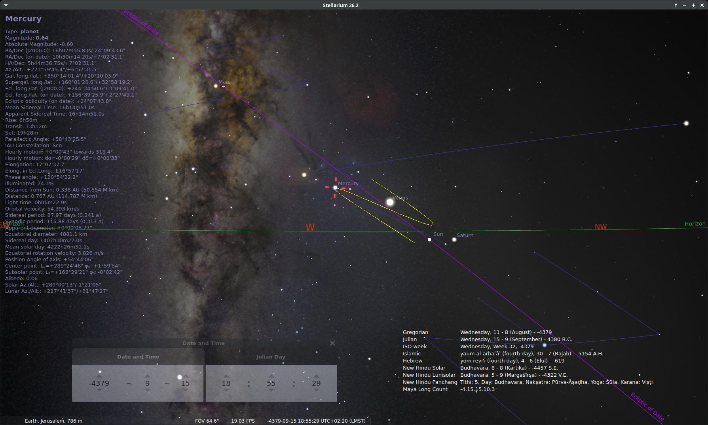

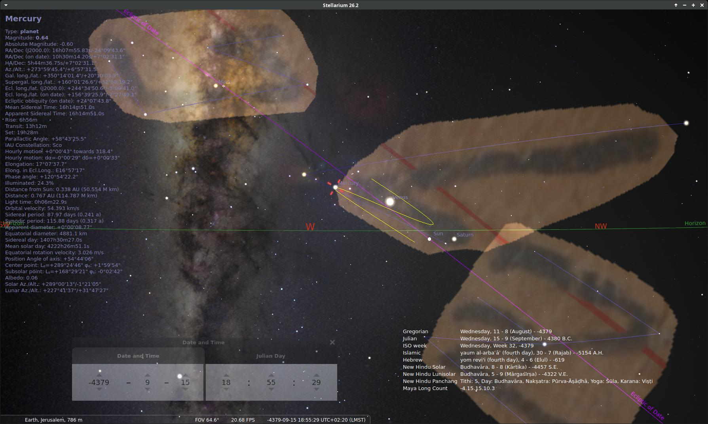

**Discussion:**
 - Lexical meaning: Ox-goad (certain).
 - Ox-goad shape: found.
 - Paleo-Hebrew letter shape: found.
 - Ktav Ashuri (Assyrian script) letter shape: pending. 
 - Sound: L

The Lamed (ox-goad), as a prefix to words, means "to" or "for" — a sense of direction.

In the Hebrew alphabet, Lamed is the one letter that is written above the red line on the page.  It seems fitting that the dark nebula that represents the ox-goad shape in relation to the galactic equator sits somewhat above all the other letters.

---

## 13. Mem (מֵם) — מ

**Meaning:** Waters

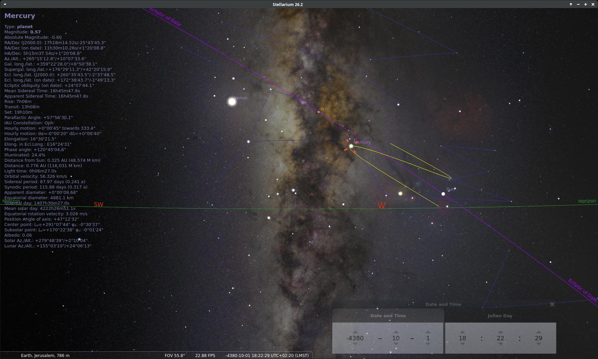

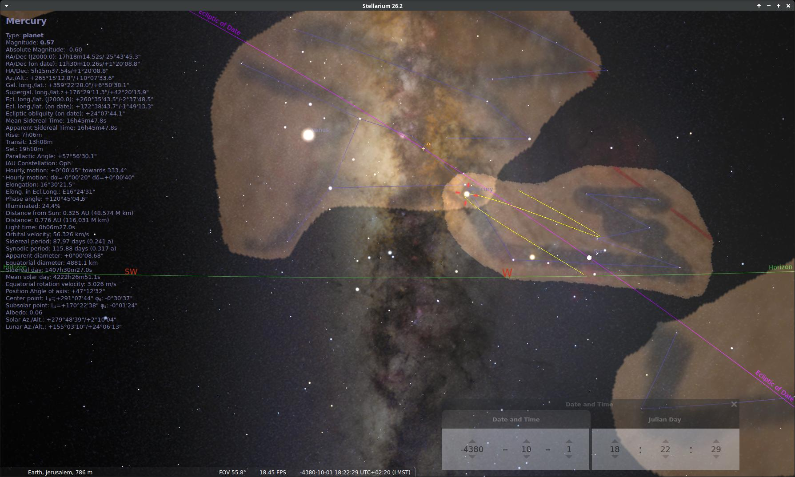

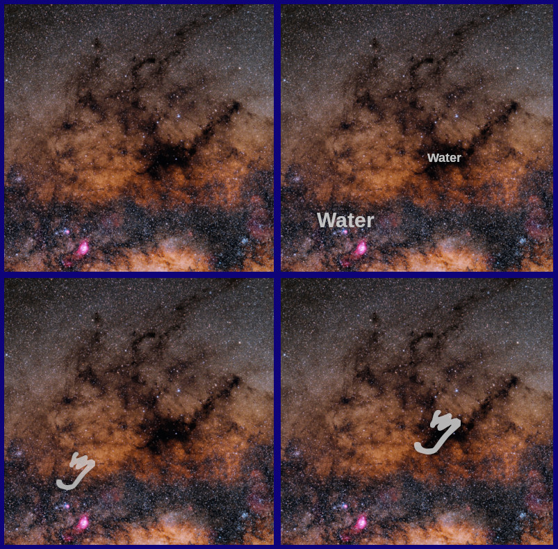

**Discussion:**
 - Lexical meaning: Waters (certain).
 - Waters shape: found.
 - Paleo-Hebrew letter shape: found.
 - Ktav Ashuri (Assyrian script) letter shape: not found. 
 - Sound: M

Attempts to understand the Mem regions:
 - Water in your mouth, lips shut, voiced — creates the 'mmm' sound.
 - Shape 1: Dark dust clouds may represent dark waters — the Mem letter is in the Ox's apparent shophar-horn shape.
 - Shape 2: The sound that Oxen make ('mmm') — the Mem letter is at the mouth of the apparent Ox shape.
 - Shape 3: A large Mem shape whose top is formed between the two horns of the Ox, with the tail running down the jawline.

This region of the Milky Way has many intricate shapes, which makes finding the letter shapes more difficult.  This galactic bulge has thousands of stars. In Hebrew grammar, when Mem is suffixed to a word, it can give it the sense of the plural (many):
| suffix      | suffix     | word form (morphology)        | translation |
|-------------|------------|-------------------------------|-------------|
| (־ִים)       | -im        | noun/adjective *plural*       | e.g. books  |
| (־ְכֶם)       | -khem      | 2nd person masculine *plural* | your/you    |
| (־ָם)        | -am        | 3rd person masculine *plural* | their/them  |
| (־ָהֶם / ־הֶם) | -ahem/-hem | 3rd person masculine *plural* | their/them  |

The next letter, Nun, is also used as a *plural* feminine suffix.

Another sequence that came to my attention forms a fishing scene when the Paleo-Hebrew letters are joined along the ecliptic path.
 - Mem — water
 - Nun — fish tail
 - Samekh — support ribs
 - Ayin — eye of the fish
 - Pe — mouth of the fish
 - Tsade — fish hook

In the calendar system, Mem marks the start of the rainy season in the Fertile Crescent region.

Note: Behind the apparent ox shape, just to the inside of his right shophar-horn, there is an apparent upside-down cone shape resembling the pile found in the center of a threshing floor.  The combination of a threshing floor, an Ox, and an Ox-goad creates memorable imagery, which we will discuss in more detail elsewhere.

See also:
 - [Testing the calendar.  Mem means water. #13](https://www.youtube.com/watch?v=l42tqwR4zPE)
 - [Fountains and floodgates - Ancient data preservation. #15](https://www.youtube.com/watch?v=R0sTtFCRQBo)

---

## 14. Nun (נּון) — נ

**Meaning:** Fish

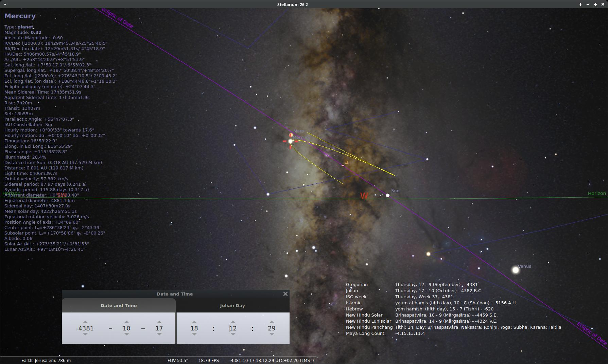

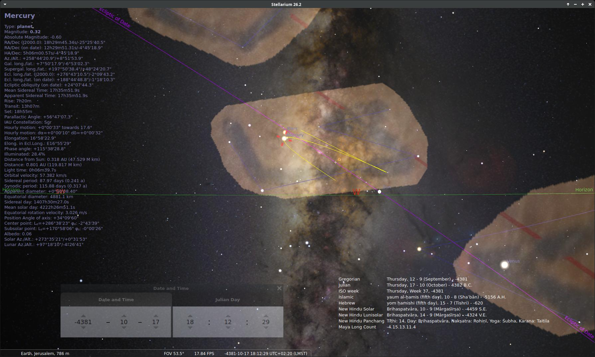

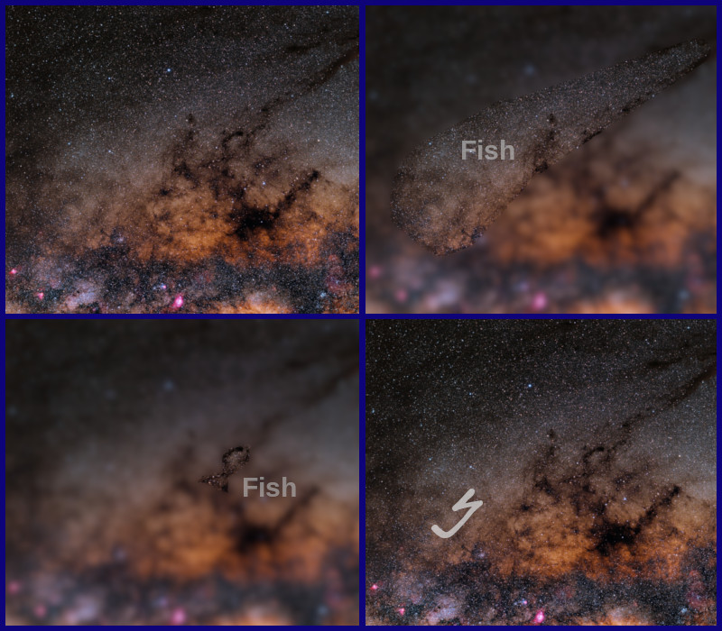

**Discussion:**
 - Lexical meaning: Fish (certain).
 - Fish shape: found multiple.
 - Paleo-Hebrew letter shape: found.
 - Ktav Ashuri (Assyrian script) letter shape: difficult — too many matches. 
 - Sound: N

The traditional meaning of Nun is *fish*, and as a verb, *propagate* or *increase*.  

Similar to Mem, this Nun region of the Milky Way has many shapes to choose from, which makes the task a bit more difficult.  And similar to Mem, Nun in the alphabet gives the sense of the plural (many) when it is suffixed to a word.
| suffix      | suffix     | word form                    | translation |
|-------------|------------|------------------------------|-------------|
| (־כֶן)       | -khen      | 2nd person feminine *plural* | your/you    |
| (־ָן)        | -an        | 3rd person feminine *plural* | they/them   |
| (־ָהֶן / ־הֶן) | -ahen/-hen | 3rd person feminine *plural  | they/them   |

---

## 15. Samekh (סָמֶך) — ס

**Meaning:** Support, prop

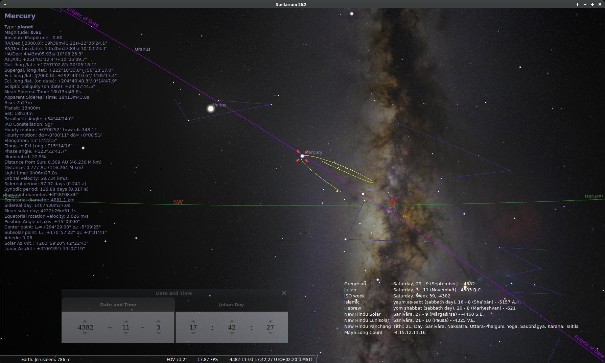

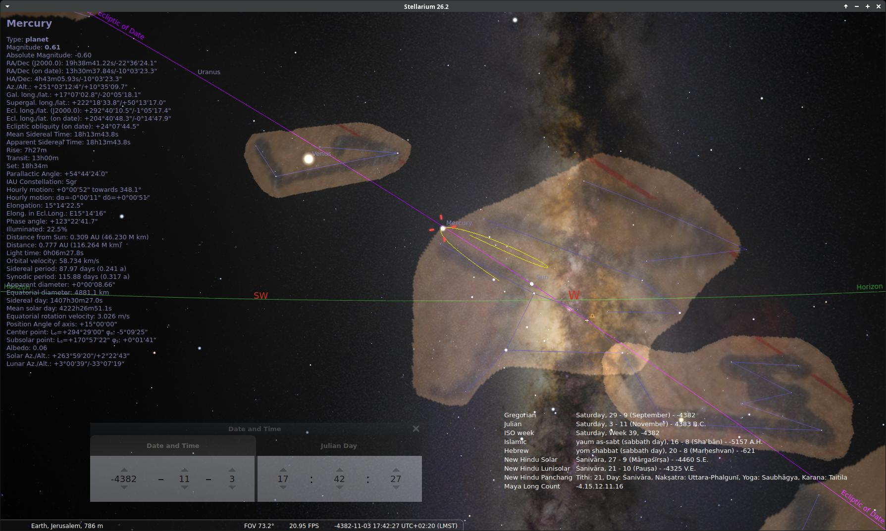

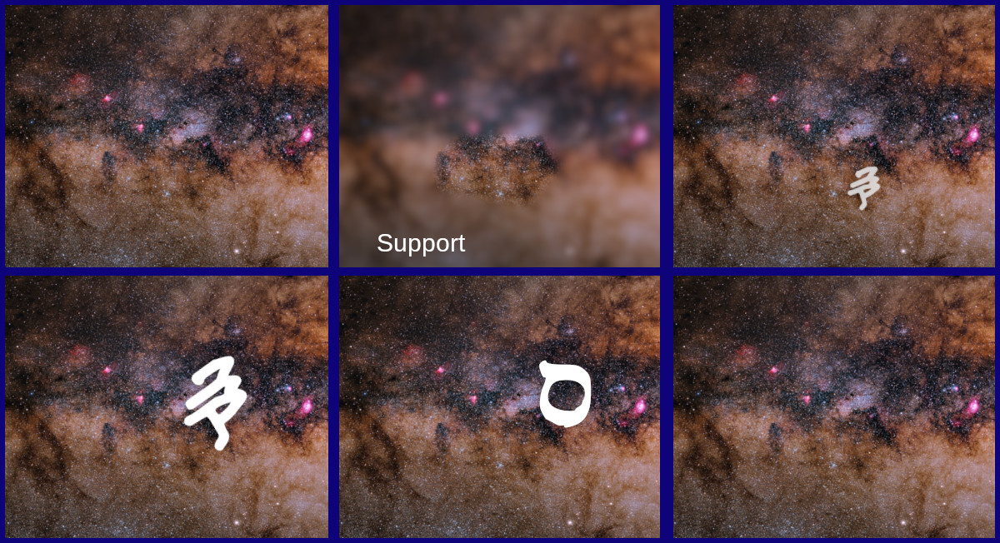

**Discussion:**
 - Lexical meaning: Support or sustain.
 - Support shape: found.
 - Paleo-Hebrew letter shape: difficult.
 - Ktav Ashuri (Assyrian script) letter shape: found. 
 - Sound: "S"

The shape of support or sustain may be this apparent box structure. Resembling a shelter, a house or a feed trough.

Several acrostic Psalms represent this letter with a word that is very similar to the letter's name itself.

 > *Sustain-me* according to Thy saying, 
 > And I live, and Thou puttest me not to shame Because of my hope. 
 > 
 > סָמְכֵנִי כְ‍אִמְרָתְךָ וְאֶחְיֶה וְאַל־תְּבִישֵׁנִי מִ‍שִּׂבְרִי׃ 
 > 
 > Psalm 119:116

 > Yahweh *is-supporting* all who are falling, 
 > And raising up all who are bowed down. 
 > 
 > סוֹמֵךְ יְהוָה לְכָל־הַנֹּפְלִים וְזוֹקֵף לְכָל־הַכְּפוּפִים׃  
 > 
 > Psalm 145:14

 > *They-stand-fast* forever and ever, 
 > And-are-done in truth and uprightness. 
 > 
 > סְמוּכִים לָעַד לְעוֹלָם 
 > עֲשׂוּיִם בֶּאֱמֶת וְיָשָׁר׃ 
 > 
 > Psalm 111:8

 > *Established* is his heart; 
 > He will not be afraid, 
 > Until he sees his desire upon his enemies. 
 > 
 > סָמוּךְ לִבּוֹ 
 > לֹא יִירָא 
 > עַד אֲשֶׁר־יִרְאֶה בְצָרָיו׃ 
 > 
 > Psalm 112:8

See: [Decoding Samek constellation: to support, to sustain #25](https://www.youtube.com/watch?v=gA-iPK3v_Fo)

---

## 16. Ayin (עַיִן) — ע

**Meaning:** Eye (also meaning a physical spring/fountain)

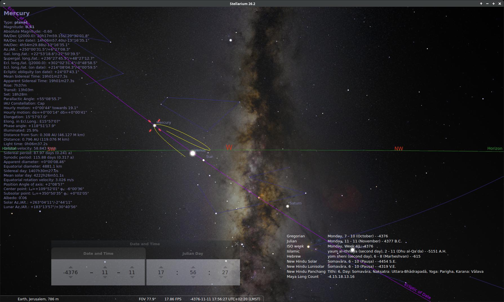

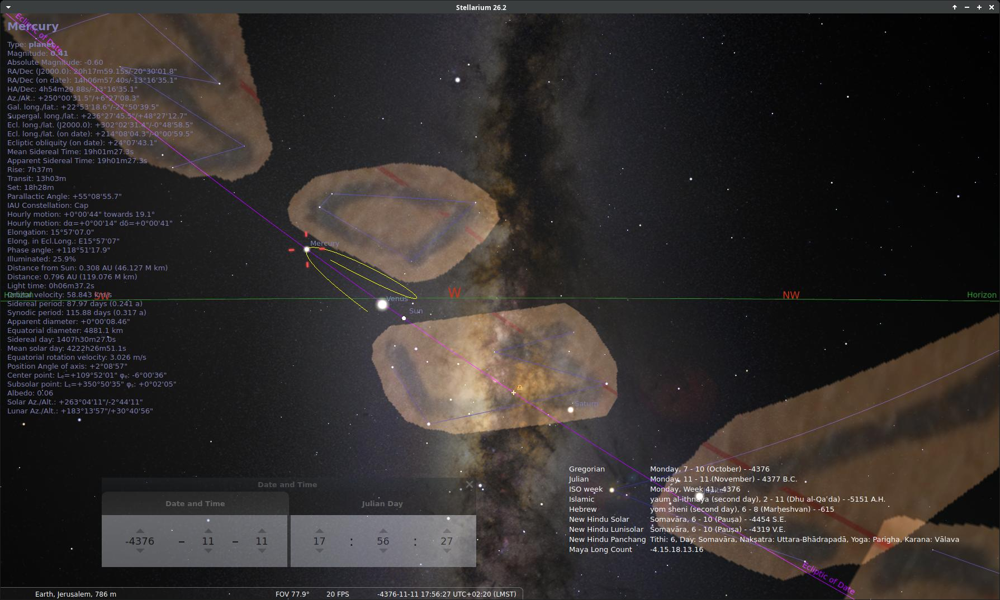

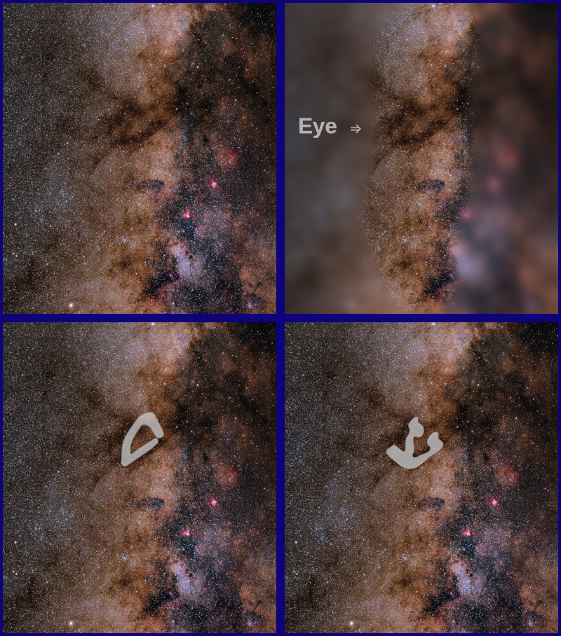

**Discussion:**
 - Lexical meaning: Eye/spring (certain).
 - Eye shape: found.
 - Paleo-Hebrew letter shape: found.
 - Ktav Ashuri (Assyrian script) letter shape: found. 
 - Sound: guttural, like the glottal stop in the English word *bo'tle* — the sound made when someone cries and runs out of breath for a brief moment.

This apparent shape of an Ayin/Eye was much easier to pick out because it is part of a face, while the right half of the face is in shadow.  In Hebrew, *Ayin* is both Eye and Spring, as both can gush out water.  *Ayin* also appears in a Hebrew idiom where a *good eye* means generous and a *bad eye* means stingy — I find this idiom makes more sense when compared to coming upon a *good spring* or a *bad spring* when thirsty.

The traditional name matches several acrostic passages:
> *My-eyes* are ever toward the LORD, 
> For He shall-pluck my feet out of the net. 
>
> עֵינַי תָּמִיד אֶל־יְהוָה
> כִּי הוּא־יוֹצִיא מֵ‍רֶשֶׁת רַגְלָי׃
 Psalm 25:15

> *The eyes* of the LORD are on the righteous, 
> And-His-ears are open to their cry. 
>
> עֵינֵי יְהוָה אֶל־צַדִּיקִים
> וְאָזְנָיו אֶל־שַׁוְעָתָם׃
 Psalm 34:15

> *Mine-eyes* have been consumed for Thy salvation.  
> And for the saying of Thy righteousness. 
> 
> עֵינַי כָּלוּ לִישׁוּעָתֶךָ וּלְאִמְרַת צִדְקֶךָ׃
 Psalm 119:123

> *The-eyes* of all unto Thee do look, 
> And Thou art giving to them their food in-its-season, 
> 
> עֵינֵי־כֹל אֵלֶיךָ יְשַׂבֵּרוּ וְאַתָּה נוֹתֵן־לָהֶם אֶת־אָכְלָם בְּעִתּוֹ׃
 Psalm 145:15

> *Mine-eye* is poured out,  
> And doth not cease without intermission, 
> 
> עֵינִי נִגְּרָה וְלֹא תִדְמֶה מֵ‍אֵין הֲפֻגוֹת׃
>
> *My-eye* affecteth my soul,  
> Because of all the daughters of my city. 
> 
> עֵינִי עוֹלְלָה לְנַפְשִׁי מִ‍כֹּל בְּנוֹת עִירִי׃  ס
 Lamentations 3:49, 51

See: [Decoding an Ayin nebula: an Eye, a Spring #24](https://www.youtube.com/watch?v=WXlz6gGHKME)
---

## 17. Pe (פֶּה) — פ

**Meaning:** Mouth

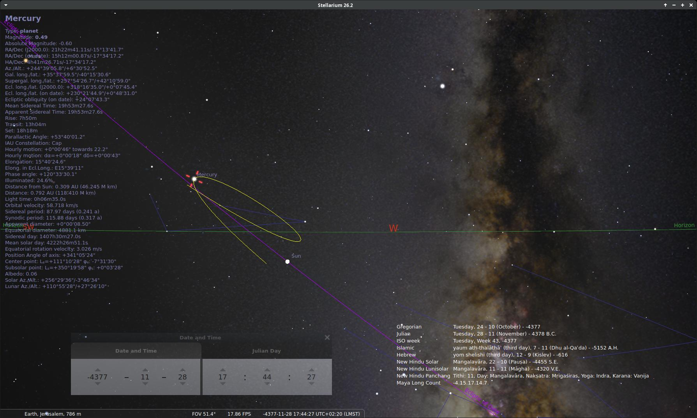

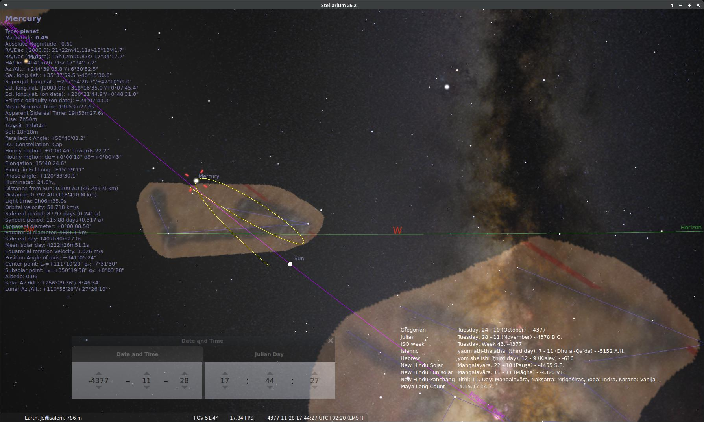

**Discussion:**
 - Lexical meaning: Mouth (certain).
 - Mouth shape: found.
 - Paleo-Hebrew letter shape: found.
 - Ktav Ashuri (Assyrian script) letter shape: found.

The mouth and letter shape were easy to find.  *Pe* has a voiceless *P* sound made by pushing air through the lips.  The mouth shape of the nebula represents lips forming that sound.

Without looking at the Milky Way but stringing the Paleo-Hebrew letters together, I noticed the letters form a static animation of a fish being pulled from the water with a fish-hook.
 - Mem (Water),
 - Nun (Fish resembling the tail of a fish),
 - Samekh (Support body of fish),
 - Ayin (eye of fish),
 - Pe (mouth of fish),
 - Tsadi (fish-hook)

---

## 18. Tsadi (צַדִּי) — צ

**Meaning:** Fish-hook or side/hunt

**Discussion:**
 - Lexical meaning: Fish-hook.
 - Fish hook shape: found (difficult).
 - Paleo-Hebrew letter shape: found (difficult).
 - Ktav Ashuri (Assyrian script) letter shape: found. 

I found it difficult to locate a fish hook shape and the shape of the Paleo-Hebrew letter.

---

## 19. Qof (קוּף) — ק

**Meaning:** Monkey

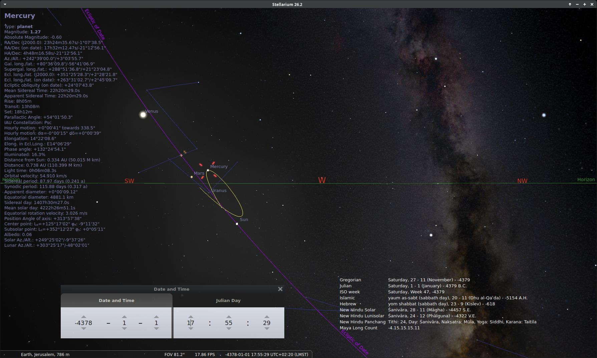

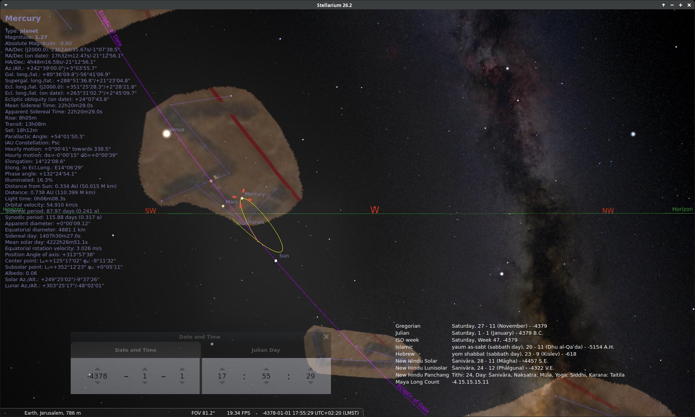

**Discussion:**
 - Lexical meaning: Monkey or Back of neck (certain).
 - Monkey shape: found 2.
 - Paleo-Hebrew letter shape: found.
 - Ktav Ashuri (Assyrian script) letter shape: found. 

Finding a monkey shape is relatively easy and matches the letter shape.  I could not find the shape of the back of the neck, so it might be that the scholars were attempting to describe the location where the *Qof* sound comes from in the lower throat, paired with the shape of the letter.

See: [Decoding Qof and Resh: a Monkey and a Head #26](https://www.youtube.com/watch?v=ih_0SDwW4vc)
---

## 20. Resh (רֹאשׁ) — ר

**Meaning:** Head (of a lion)

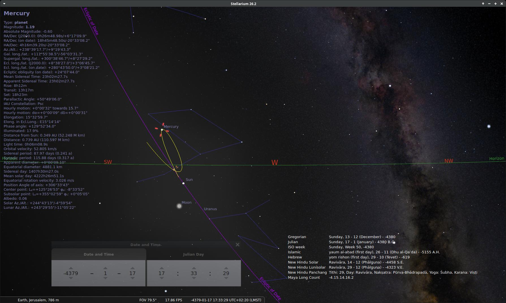

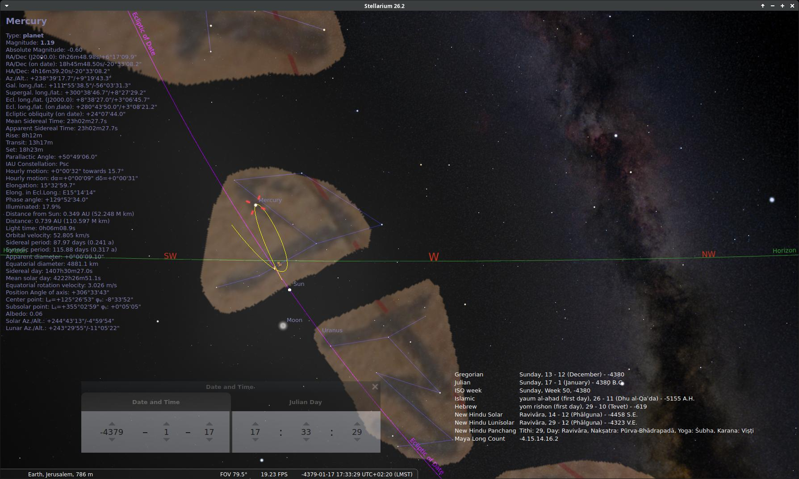

**Discussion:**
 - Lexical meaning: Head.
 - Head shape: found head of lion or bear.
 - Paleo-Hebrew letter shape: found.
 - Ktav Ashuri (Assyrian script) letter shape: found. 

Lexicons and those who study Hebrew alphabet will sometimes refer to the shape of a head of a man.  However, the apparent shape of the Head is that of a Lion or Bear, which suddenly makes more sense when we consider the *R* sound that *Resh* makes.

TODO: Once finished, the 22 Retrograde loops of Mercury show how this region relates to the Lunar calendar region of the tribe of Gad, as the lion, torn arm, and crown of the head are all visible here.

> Of Gad he said,
> “Blessed is the one who enlarges Gad; 
> He lies down as a lion, 
> And tears the arm, also the crown of the head. 
> He provided the first (רֵאשִׁית֙) part for himself,
> Because a lawgiver’s portion was reserved there.
> He came with the heads (רָ֣אשֵׁי) of the people;
> He administered the justice of the Lord,
> And His judgments with Israel.”  Deut 33:20-21

---

## 21. Shin (שִׁין) — ש

**Meaning:** Teeth

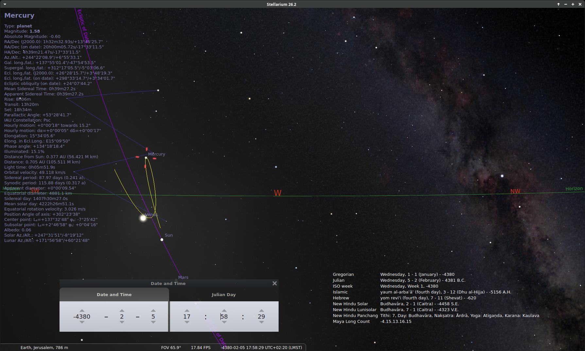

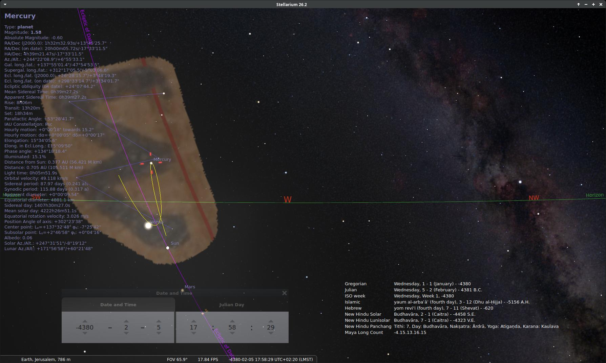

**Discussion:**
 - Lexical meaning: Teeth.
 - Teeth shape: found multiple.
 - Paleo-Hebrew letter shape: found.
 - Ktav Ashuri (Assyrian script) letter shape: found. 

---

## 22. Tav (תָּו) — ת

**Meaning:** Mark, cross, or sign

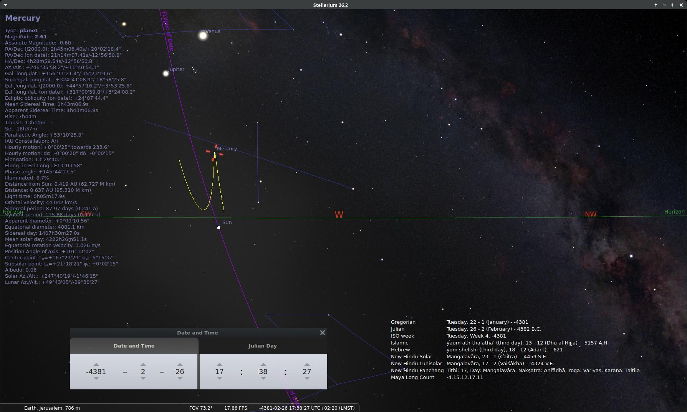

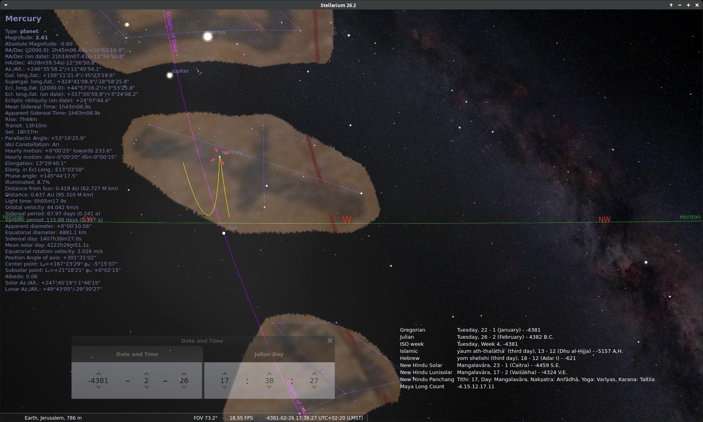

**Discussion:**
 - Lexical meaning: Mark.
 - Mark shape: found.
 - Paleo-Hebrew letter shape: found.
 - Ktav Ashuri (Assyrian script) letter shape: found. 

---

## Appendix - Greek Alphabet

Greek Alphabet borrowed from Hebrew.

Below is a table mapping the historical correspondence between the two alphabets, including archaic Greek letters (Digamma, San, and Qoppa) that eventually fell out of standard use.

| Hebrew Name | Symbol | Greek Name | Symbol |
| :--- | :---: | :--- | :---: |
| **Aleph** | א | **Alph-a** | Α, α |
| **Bet** | ב | **Bet-a** | Β, β |
| **Gimel** | ג | **Gamm-a** | Γ, γ |
| **Dalet** | ד | **Delt-a** | Δ, δ |
| **He** | ה | **Epsilon** | Ε, ε |
| **Vav** | ו | **(Digamma)** | Ϝ, ϝ |
| **Zayin** | ז | **Zet-a** | Ζ, ζ |
| **Khet** | ח | **-Et-a** | Η, η |
| **Tet** | ט | **Thet-a** | Θ, θ |
| **Yod** | י | **Iot-a** | Ι, ι |
| **Kaph** | כ | **Kapp-a** | Κ, κ |
| **Lamed** | ל | **Lambd-a** | Λ, λ |
| **Mem** | מ | **Mu** | Μ, μ |
| **Nun** | נ | **Nu** | Ν, ν |
| **Samekh** | ס | **Xi** | Ξ, ξ |
| **Ayin** | ע | **Omicron** | Ο, ο |
| **Pe** | פ | **Pi** | Π, π |
| **Tsadi** | צ | **(San)** | Ϻ, ϻ |
| **Qof** | ק | **(Qopp-a)** | Ϙ, ϙ |
| **Resh** | ר | **Rho** | Ρ, ρ |
| **Shin** | ש | **Sigm-a** | Σ, σ, ς |
| **Tav** | ת | **Tau** | Τ, τ |

*(Note: Some Hebrew letters like Kaph, Mem, Nun, Pe, and Tsadi have different forms when they appear at the very end of a word, though only the standard forms are shown here for simplicity).*

### Hebrew → Greek Alphabet: What Was Lost and Added

Hebrew (Semitic) and Greek (Indo-European) have different sound inventories. Greek resolved the mismatch by repurposing, dropping, and adding letters.

#### Lacking in Greek (Hebrew sounds with no equivalent)

| Hebrew Letter | Sound | Fate in Greek |
|---|---|---|
| Aleph (א) | Glottal stop | Repurposed as vowel **Alpha (Α)** |
| He (ה) | Soft "h" | Repurposed as vowel **Epsilon (Ε)** |
| Het (ח) | Harsh throaty "ch" | Repurposed as vowel **Eta (Η)** |
| Ayin (ע) | Pharyngeal fricative | Repurposed as vowel **Omicron (Ο)** |
| Shin (ש) | "Sh" | Became **Sigma (Σ)**, pronounced only as "s" |
| Tsadi (צ) | "Ts" | Adopted as **San (Ϻ)**, later dropped entirely |
| Qof (ק) | Deep guttural "k" | Adopted as **Qoppa (Ϙ)**, dropped as redundant with Kappa |

#### Added in Greek (no Hebrew equivalent)

Greek needed true vowel sounds Hebrew's consonantal script didn't mark, and added distinct long/short vowel and diphthong letters not present in the Hebrew system — most notably:

- **Vowels created via repurposing**: Alpha, Epsilon, Eta, Omicron, and later **Upsilon (Υ)** — giving Greek a full set of written vowels, unlike Hebrew's consonant-only base script.
- **Omega (Ω)**: a distinct long "o," added later to distinguish long from short vowels.
- **Phi (Φ), Chi (Χ), Psi (Ψ)**: added to represent aspirated/compound sounds native to Greek but absent in Hebrew.

#### Core Logic

- **Repurpose**: Hebrew consonants Greek didn't need (gutturals) became Greek's first vowels.
- **Narrow**: Sounds partially shared (Shin/Sigma) were kept but simplified to fit Greek phonology.
- **Drop**: Emphatic consonants (Tsadi, Qof) were redundant once standard equivalents existed, and were discarded.
- **Add**: Greek supplemented the borrowed alphabet with new vowel and consonant letters to capture sounds Hebrew never needed to write.

