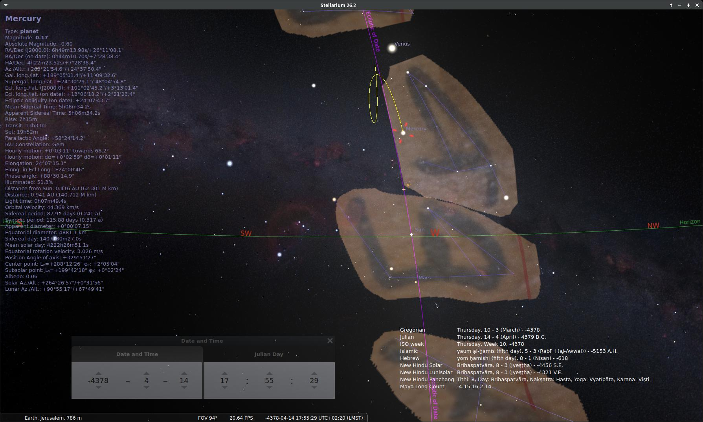
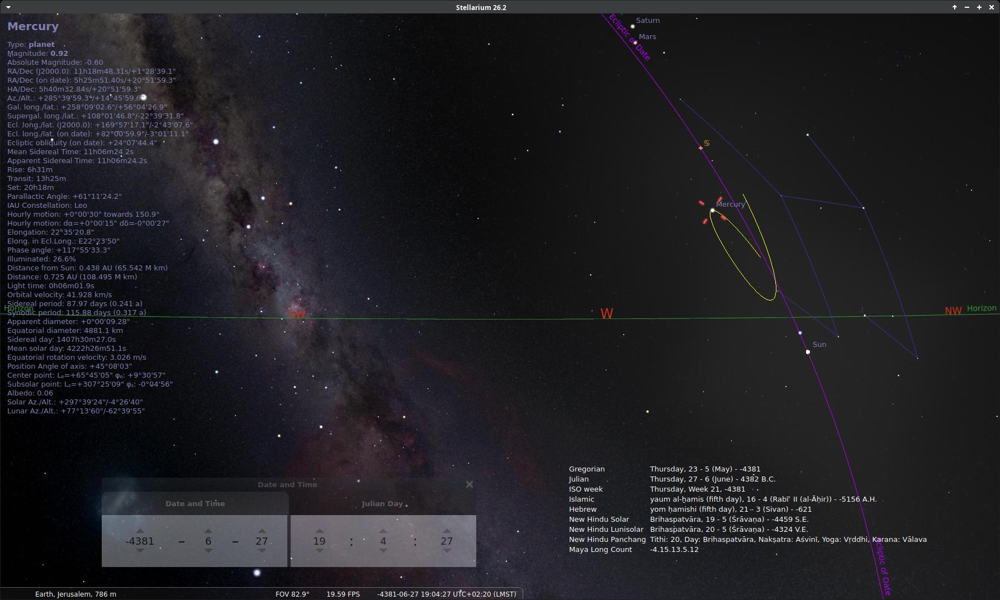
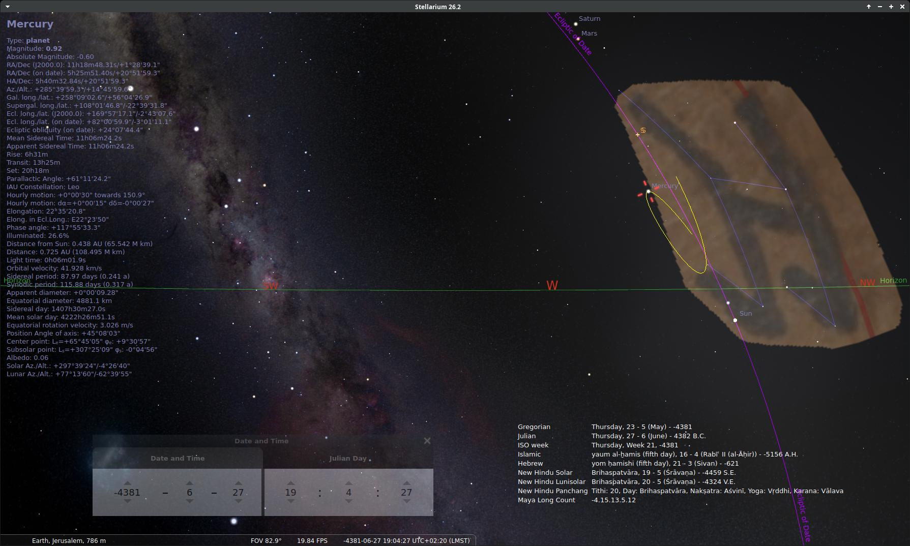
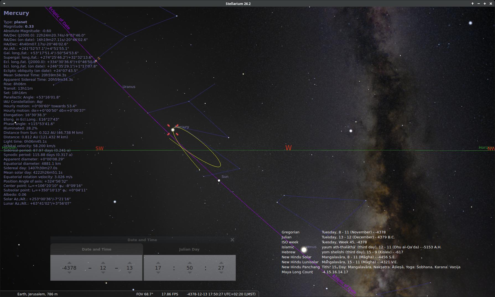
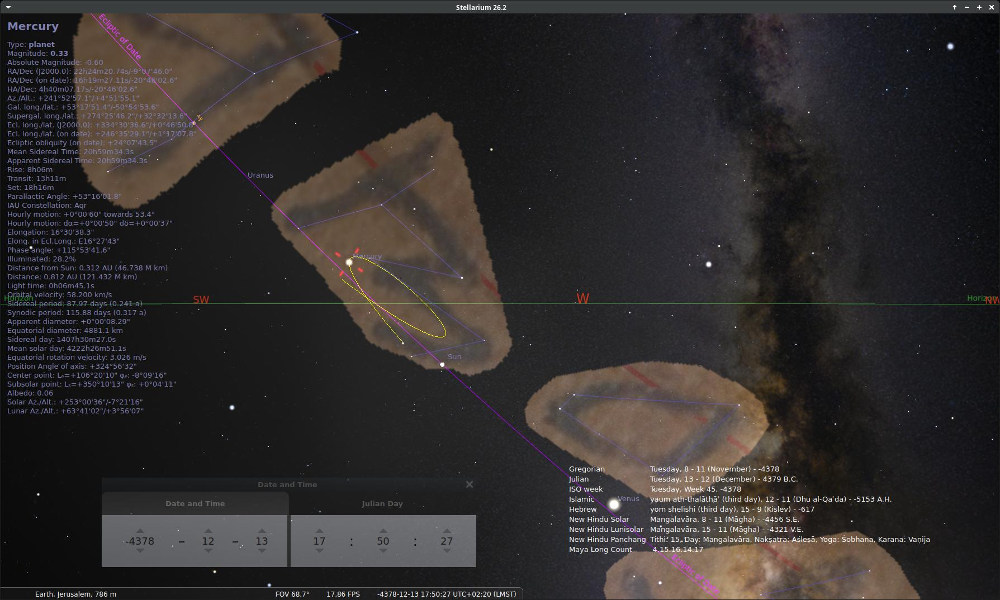

# Hebrew Alphabet (Alef-Tav)

This is a preliminary research project investigating how the 22 letters of the Hebrew alphabet were part of a calendar system. Mercury, the innermost planet, has a faster orbit than Earth and creates a pattern of rising and setting at sunset 3 times a year and 22 times over 7 years. Apparent shapes in the Milky Way matching the meaning of each letter appear to have been used to name regions of space along the ecliptic. The sunset horizon was a transversal line to map named regions of the Milky Way to the ecliptic path of the sun, moon, and planets. The following 22 apparent retrograde loops were created using Stellarium, and the letters and meanings were overlaid using GNU Image Manipulation Program.

Stellarium Starting in -2726, 2, 26: *Alef*.  When Mercury returns to *Alef* after 3 loops it loops on the previous letter *Tav* instead of *Alef*.

| REGION 1 | REGION 2 | REGION 3 |
|----------|----------|----------|
| Alef     | Khet     | Samekh   |
| Tav      | Zayin    | Nun      |
| Shin     | Vav      | Mem      |
| Resh     | He       | Lamed    |
| Qof      | Dalet    | Kaf      |
| Tsadi    | Gimel    | Yod      |
| Pe       | Bet      | Tet      |
| Ayin     | *Alef*   | -        |

---
## Overview

For each letter:
 - Stellarium image of the location of Mercury's retrograde loop position.
 - Image of [11Q1 - 11Q paleoLev](https://www.deadseascrolls.org.il/explore-the-archive/image/B-513117) Paleo Hebrew letter overlaid over that region.
 - Follow the green sunset horizon line to the Milky Way...
 - Use the meaning of the Paleo Hebrew Letter to identify both the shape and the letter itself.
 - Discussion on each.
   - Easy to find or Difficult to find matches.
   - Multiple matches or no matches.

---

## 1. Aleph (אָלֶף) — א

**Meaning:** Ox

**Discussion:**
 - Lexical meaning: Ox (certain)
 - Ox shape: found one (easy).
 - Paleo Hebrew letter shape: found one (easy).
 - Ktav Ashuri (Assyrian script) letter shape: found one (easy).

The star region shows an apparent shape of an Ox which I found was easy to find.  Inside Stellarium Sky Cultures we find this region has a shared meaning:
 - Bull
 - [Taurus](https://en.wikipedia.org/wiki/Taurus_(constellation)) (Roman/Latin for Bull)

It seems the clear dark desert skies of the fertile crescent gave astronomers and astrologers the apparent shape of an Ox or Bull in the Milky Way that was passed between nations. Hebrews, Egyptians, Babylonians, Medes & Persians, Greeks, Romans, etc.  However, it is apparent that astronomers who did not always observe the night sky from the desert regions had to rely on the stars only because the Milky Way is not as clear to see — even to the point where the Milky Way shapes have been forgotten.

The Alef letter shape is not depicting the Ox itself but rather a dark cloud nebula at the mouth of the Ox.  This makes sense because the sound of Alef resembles the sound that an Ox makes. See [Decoding Alef: An Ox shape in the nebula? #19](https://www.youtube.com/watch?v=p5pBJx-jWuE).

---

## 2. Bet (בֵּית) — ב

**Meaning:** House

**Discussion:**
 - Lexical meaning: House (certain)
 - House shape: found multiple.
 - Paleo Hebrew letter shape: found multiple.
 - Ktav Ashuri (Assyrian script) letter shape: found multiple.

The regions where the ecliptic path bisects the Milky Way I find more difficult as there are multiple shapes that match the meaning of the letter.  Shapes found in both west sunset and east sunrise orientations of the Milky Way.

[Decoding Beth: a House shape in the nebula? #21](https://www.youtube.com/watch?v=kCLfgkLFryU)

---

## 3. Gimel (גִּימֶל) — ג

**Meaning:** Camel

**Discussion:**
 - Lexical meaning: Camel (certain)
 - Camel shape: found two.
 - Paleo Hebrew letter shape: found multiple.
 - Ktav Ashuri (Assyrian script) letter shape: found multiple.

There seem to be 2 Camel shapes that match.  There are also about 3 regions that match the letter shape.

---

## 4. Dalet (דָּלֶת) — ד

**Meaning:** Door

**Discussion:**
 - Lexical meaning: Door (certain)
 - Door shape: 
 - Paleo Hebrew letter shape: 
 - Ktav Ashuri (Assyrian script) letter shape: 

---

## 5. He (הֵא) — ה

**Meaning:** Window or lattice

**Discussion:**
 - Lexical meaning: Window (certain)
 - Window shape: found multiple
 - Paleo Hebrew letter shape: 
 - Ktav Ashuri (Assyrian script) letter shape: 

This one is difficult as there are multiple faint shapes in the Milky Way. This portion of the Milky Way also sits low on the horizon, so it would have been difficult to see.

---

## 6. Vav (וָווּ) — ו

**Meaning:** Hook (conjunction joining two ideas)

**Discussion:**
 - Lexical meaning: Hook (certain)
 - Hook shape: 
 - Paleo Hebrew letter shape: 
 - Ktav Ashuri (Assyrian script) letter shape: 

---

## 7. Zayin (זַיִין) — ז

**Meaning:** Weapon (of a man)

**Discussion:**
 - Lexical meaning: Weapon *of a man* (uncertain)
 - Weapon shape: 
 - Paleo Hebrew letter shape: 
 - Ktav Ashuri (Assyrian script) letter shape: 

---

## 8. Chet (חֵית) — ח

**Meaning:** Fence

**Discussion:**
 - Lexical meaning: Fence (uncertain)
 - Fence shape: 
 - Paleo Hebrew letter shape: 
 - Ktav Ashuri (Assyrian script) letter shape: 

---

## 9. Tet (טֵית) — ט

**Meaning:** Serpent, clay, or a spinning wheel

**Discussion:**
 - Lexical meaning: Spinning wheel, serpent (uncertain)
 - Spinning wheel shape: 
 - Paleo Hebrew letter shape: 
 - Ktav Ashuri (Assyrian script) letter shape: 

---

## 10. Yod (יָד) — י

**Meaning:** Hand

**Discussion:**
 - Lexical meaning: Hand (certain)
 - Hand shape: 
 - Paleo Hebrew letter shape: 
 - Ktav Ashuri (Assyrian script) letter shape: 

---

## 11. Kaf (כָּף) — כ

**Meaning:** Palm (of the hand or foot)

**Discussion:**
 - Lexical meaning: Palm of hand *or foot*
 - Palm shape: 
 - Paleo Hebrew letter shape: 
 - Ktav Ashuri (Assyrian script) letter shape: 

---

## 12. Lamed (לָמֶד) — ל

**Meaning:** Ox-goad (cattle prod)

**Discussion:**
 - Lexical meaning: Ox-goad (certain)
 - Ox-goad shape: 
 - Paleo Hebrew letter shape: 
 - Ktav Ashuri (Assyrian script) letter shape: 

---

## 13. Mem (מֵם) — מ

**Meaning:** Waters

**Discussion:**
 - Lexical meaning: Waters (certain)
 - Waters shape: 
 - Paleo Hebrew letter shape: 
 - Ktav Ashuri (Assyrian script) letter shape: 

---

## 14. Nun (נּון) — נ

**Meaning:** Fish

**Discussion:**
 - Lexical meaning: Fish (certain)
 - Fish shape: 
 - Paleo Hebrew letter shape: 
 - Ktav Ashuri (Assyrian script) letter shape: 

---

## 15. Samekh (סָמֶךְ) — ס

**Meaning:** Support, prop

**Discussion:**
 - Lexical meaning: Support (uncertain)
 - Support shape: 
 - Paleo Hebrew letter shape: 
 - Ktav Ashuri (Assyrian script) letter shape: 

---

## 16. Ayin (עַיִן) — ע

**Meaning:** Eye (also meaning a physical spring/fountain)

**Discussion:**
 - Lexical meaning: Eye/spring (certain)
 - Eye shape: 
 - Paleo Hebrew letter shape: 
 - Ktav Ashuri (Assyrian script) letter shape: 

---

## 17. Pe (פֵּא) — פ

**Meaning:** Mouth

**Discussion:**
 - Lexical meaning: Mouth (certain)
 - Mouth shape: found
 - Paleo Hebrew letter shape: found
 - Ktav Ashuri (Assyrian script) letter shape: found

The mouth and letter shape were easy to find.  *Pe* has an unvoiced *P* sound made by pushing air through the lips.  The mouth shape of the nebula represents the lips.

Without looking at the Milky Way but stringing the Paleo-Hebrew letters together I noticed the letters form a static animation of a fish being pulled from the water with a fishhook.
 - Mem (Water),
 - Nun (Fish resembling tail of fish),
 - Samekh (Support body of fish),
 - Ayin (eye of fish),
 - Pe (mouth of fish),
 - Tsade (fish hook)

---

## 18. Tsadi (צָדִי) — צ

**Meaning:** Fishhook or side/hunt

**Discussion:**
 - Lexical meaning: Fishhook
 - Fishhook shape: found (difficult)
 - Paleo Hebrew letter shape: found (difficult)
 - Ktav Ashuri (Assyrian script) letter shape: 

I found it difficult to locate a fish-hook shape and the shape of the Paleo Hebrew letter.

---

## 19. Qof (קוּף) — ק

**Meaning:** Monkey

**Discussion:**
 - Lexical meaning: Monkey or Back of neck (certain)
 - Monkey shape: found 2
 - Paleo Hebrew letter shape: found
 - Ktav Ashuri (Assyrian script) letter shape: 

Finding a monkey shape is relatively easy and matches the letter shape.  I could not find the shape of the back of the neck, so it might be the scholars were attempting to describe the location where the *Qof* sound comes from in the lower throat, paired with the shape of the letter.

---

## 20. Resh (רֵישׁ) — ר

**Meaning:** Head (of a lion)

**Discussion:**
 - Lexical meaning: Head
 - Head shape: found head of lion or bear.
 - Paleo Hebrew letter shape: 
 - Ktav Ashuri (Assyrian script) letter shape: 

Lexicons and those who study Hebrew alphabet will sometimes refer to the shape of a head of a man.  However, the apparent shape of the Head is that of a Lion or Bear, which suddenly makes more sense when we consider the *R* sound that *Resh* makes.

TODO: Once finished the 22 Retrograde loops of Mercury show how this region relates to the Lunar calendar region of the tribe of Gad as the lion, torn arm and crown of the head are all visible here.

> Of Gad he said,
> “Blessed is the one who enlarges Gad; 
> He lies down as a lion, 
> And tears the arm, also the crown of the head. 
> He provided the first(רֵאשִׁית֙) part for himself,
> Because a lawgiver’s portion was reserved there.
> He came with the heads(רָ֣אשֵׁי) of the people;
> He administered the justice of the Lord,
> And His judgments with Israel.”  Deut 33:20-21

---

## 21. Shin (שִׁין) — ש

**Meaning:** Teeth

**Discussion:**
 - Lexical meaning: Teeth
 - Teeth shape: found multiple.
 - Paleo Hebrew letter shape: 
 - Ktav Ashuri (Assyrian script) letter shape: 

---

## 22. Tav (תָּו) — ת

**Meaning:** Mark, cross, or sign

**Discussion:**
 - Lexical meaning: Mark
 - Mark shape: found.
 - Paleo Hebrew letter shape: found.
 - Ktav Ashuri (Assyrian script) letter shape: 

---
