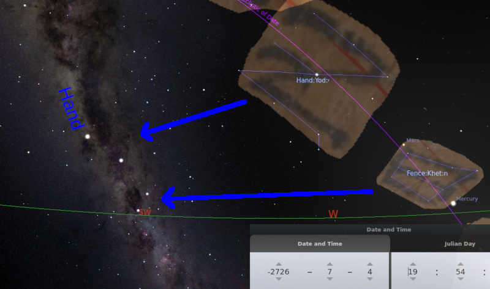
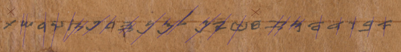
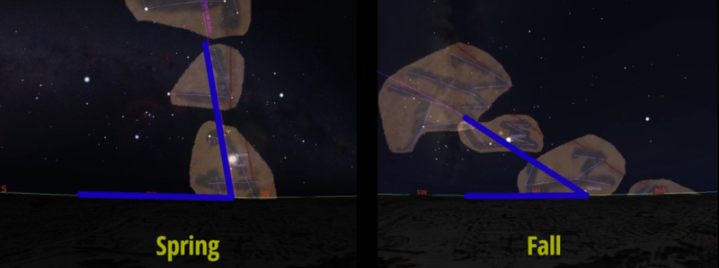

# Alef Bet Art Combined

## Introduction

This preliminary research project investigates how the
Paleo Hebrew alphabet is part of an ancient calendar system.

- [Alef-Tav Calendar Github Repository](https://github.com/alef-tav-calendar/alef-tav-calendar/)
- [Alef-Tav Calendar Video Explanations](https://www.youtube.com/playlist?list=PLbRaSh0207d5oxxRnekgN2GdKQNFtZT2z)
- alef.tav.calendar@gmail.com

## Description

Normally constellations consist of connecting bright stars with imaginary
"bone" lines similar to a dot-to-dot book.  This list of constellations
follows this traditional sense.  However, it seems this ancient calendar
system used a different method to divide the ecliptic path into 22 regions.

The Milky way appears to have been used as a face to this star calendar system.
Each letter of the Hebrew alphabet has a meaning which is lost in the various
alphabets derived from Hebrew. The Letter meaning is describing an apparent shape,
or pareidolia, that can be identified in the Milky Way.  Next to the apparent
shape you also find another shape that resembles the Paleo Hebrew Letter itself.
When the ecliptic is above or below the Milky Way, the sunset horizon is then used
as a transversal line between the ecliptic and the Milky way.

There is no way to truly tell which stars should be used to make up each
letter.  Sometimes there can be more than one match.  Yet the apparent 
shapes in the Milky Way are relatively easy to pick out. This constellation
map should be considered a just a rough estimate and one must use discretion
while using this tool.

The Dead Sea Scrolls 11Q1 paleoLev Leviticus scrolls contain letters 
that appear to be more complex and advanced than Ashuri letters. These
letters contain more details than the letters inscribe in stone like
the Siloam Inscription found in Hezekiah's tunnel.  The scrolls have a line behind
the letters that can be aligned with the ecliptic.  The angle of the vertical
pen-stroke of each letter changes in relation to the line on the scrolls.
The vertical pen stroke inside the letter represents the horizon.  
The horizontal line that the letters hang down from represents
the ecliptic path.  The changing angle of the vertical pen stroke in relation to the 
line across the page represents the change in angle of earths horizon
in relation to the ecliptic path over the course of a year.

 
Various clues used to arrive at the current location and order:
- Sunset horizon line generally aligns with matching apparent shapes in the milky way.
- The sunset horizon was used to track time:
-- Feasts as described in Leviticus 23, Numbers 29 and elsewhere are based on a lunar(moon) calendar of about 29.5 days per month
-- The New moon is determined in the evening sunset.  Look to the horizon to find the first sliver of a moon.
-- The day starts at evening.  "evening and the morning were the first day" Genesis 1:5
- There are subtle hints that the AlefBet or Alef-Tav was part of a calendar system of markings:
-- Then God said, “Let there be lights in the firmament of the heavens to divide the day from the night; and let them be for signs(alef tav tav) and seasons, and for days and years;" Genesis 1:14.
-- "Signs" (alef tav tav)  First-letter (alef) the last-letter (tav) of the Hebrew alphabet with a final (tav) indicating plural.
- The first letter Alef is in the spring:
-- "This month shall be your beginning of months; it shall be the first month of the year to you" - Exodus 12:2  Passover is start of Aleph Bet
-- The angle between the vertical pen stroke and the line on the scroll aligns with the horizon and ecliptic respectively.
- There are many more subtle hints e.g.:
-- Then He brought him outside and said, “Look now toward heaven,
 and count the stars if you are able to number them.”
 And He said to him, “So shall your seed be." - Genesis 15:5
--- the word "count" comes from the same family of words as "scroll".
-- Psalm 19 & Psalm 119 have several hints.

## References

- [Alef-Tav Calendar Github Repository](https://github.com/alef-tav-calendar/alef-tav-calendar/)
- [Alef-Tav Calendar Video Explanations](https://www.youtube.com/playlist?list=PLbRaSh0207d5oxxRnekgN2GdKQNFtZT2z)

## Authors

- A computer programmer who loves the night sky and it's history - alef.tav.calendar@gmail.com

## Credits

- [Leon Levi Dead Sea Scrolls Digital Library](https://www.deadseascrolls.org.il/)
- The people of the book - who have accurately preserved and passed this knowledge down through time to today.
 
## License

- Creative Commons

